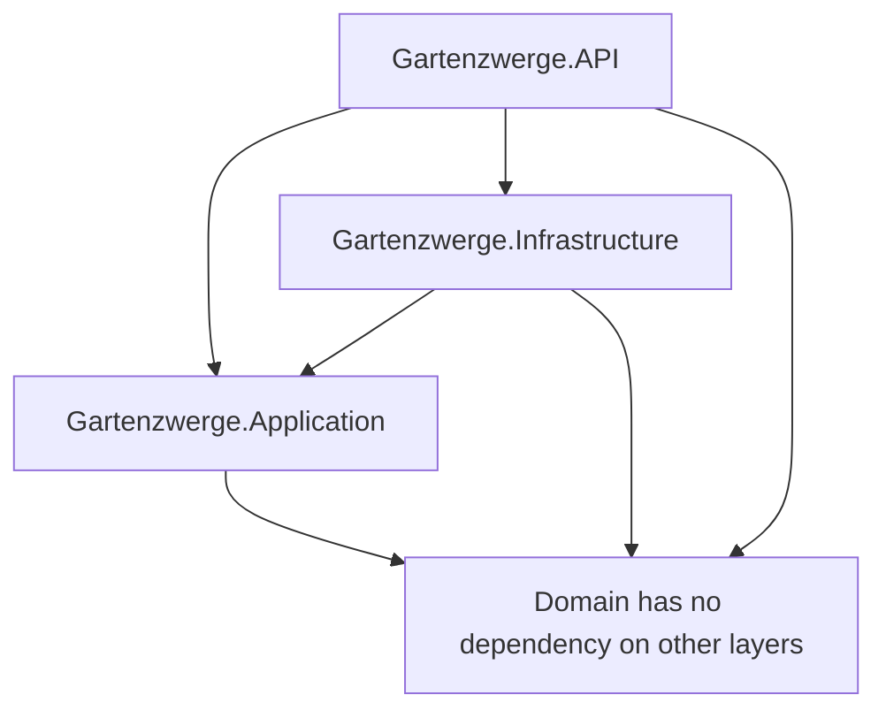

# Gartenzwerge Außenservice – Angebots- und Auftragsmanagement

A modern full-stack business management application for a landscaping and outdoor service business.

The application supports the workflow from customer management to offer creation and order conversion.

```text
Customer
→ Offer
→ Offer Items
→ Accepted Offer
→ Order
```

---

## Current Status

```text
v0.15.0 – Dashboard and Reporting UI (in progress)
```

The application is currently in active development.

The backend provides the core business API, authentication, JWT-based authorization, role-based endpoint protection and the offer-to-order workflow including order updates.

The frontend provides a protected mobile-first React client with authentication, role-aware navigation, customer management, offered service creation, offer creation, offer item handling, offer acceptance, order conversion, operational order planning and an operational dashboard with live counts and upcoming orders. The reporting side of the dashboard is still in progress.

---

## Core Features

### Customer Management

* create customers
* view customers
* update customers
* soft delete customers as Admin

### Offered Service Management

* view offered services
* create offered services as Admin
* manage service names, descriptions, units and base prices

### Offer Management

* create offers for existing customers
* create new customers during offer creation
* search and select customers while creating offers
* view offer details
* add offer items from offered services
* calculate offer item totals
* recalculate offer totals
* update offer status
* filter offers by open, archive and all

### Offer-to-Order Workflow

* accept offers
* create orders from accepted offers
* prevent duplicate order creation
* keep converted offers as historical records
* link converted offers to their related orders

### Order Management

* view all orders
* filter orders by active, completed and all
* show colored order status badges
* edit order status, planned date and notes
* show related offer information
* show original offer items
* track order status, planned date and completion date
* handle the completion date automatically in the backend

### Dashboard

* show live counts for customers, open offers and upcoming orders
* list the next planned orders sorted by planned date
* animate the dashboard statistics

### Authentication and Authorization

* register users
* log in users
* generate JWT tokens
* protect backend endpoints
* load current authenticated user through `/api/auth/me`
* support Admin and Employee roles
* protect Admin-only backend and frontend areas

---

## Tech Stack

### Backend

* C#
* ASP.NET Core 9
* Entity Framework Core
* PostgreSQL
* ASP.NET Core Identity
* JWT Bearer Authentication
* FluentValidation
* Serilog
* Swagger / OpenAPI
* xUnit
* FluentAssertions

### Frontend

* React
* TypeScript
* Vite
* React Router
* CSS with mobile-first responsive styling
* ESLint

### Infrastructure and Tooling

* Docker
* Docker Compose
* PostgreSQL container for local development
* Git and GitHub workflow

---

## Architecture Overview

The backend follows Clean Architecture principles.



### Layers

| Layer          | Responsibility                                                      |
| -------------- | ------------------------------------------------------------------- |
| Domain         | Core business entities and enums                                    |
| Application    | Use cases, business rules, DTOs, validators and interfaces          |
| Infrastructure | Database, repositories, Identity, JWT and technical implementations |
| API            | HTTP endpoints, middleware, dependency injection and authorization  |

The frontend is a separate React client that communicates with the backend through HTTP APIs.

```text
React Frontend
→ ASP.NET Core API
→ Application Layer
→ Infrastructure Layer
→ PostgreSQL
```

---

## Project Structure

```text
gartenzwerge-management/
├── docs/
│   ├── api/
│   ├── architecture/
│   ├── business-processes/
│   ├── database/
│   ├── frontend/
│   ├── journal/
│   └── project/
├── src/
│   ├── Backend/
│   │   ├── Gartenzwerge.Domain/
│   │   ├── Gartenzwerge.Application/
│   │   ├── Gartenzwerge.Infrastructure/
│   │   └── Gartenzwerge.API/
│   └── Frontend/
│       ├── src/
│       │   ├── api/
│       │   ├── app/
│       │   ├── auth/
│       │   ├── pages/
│       │   ├── shared/
│       │   └── styles/
│       ├── package.json
│       └── vite.config.ts
├── tests/
│   └── Gartenzwerge.UnitTests/
├── docker-compose.yml
├── README.md
└── .gitignore
```

---

## Local Development Setup

### Prerequisites

* .NET 9 SDK
* Node.js
* npm
* Docker Desktop

---

## Run the Backend Locally

Start PostgreSQL:

```bash
docker compose up -d
```

Apply database migrations:

```bash
cd src/Backend

dotnet ef database update --project Gartenzwerge.Infrastructure --startup-project Gartenzwerge.API
```

Run the API:

```bash
dotnet run --project Gartenzwerge.API
```

Swagger is available at:

```text
http://localhost:5041/swagger
```

---

## Run the Frontend Locally

Install dependencies:

```bash
cd src/Frontend

npm install
```

Run the development server:

```bash
npm run dev
```

The frontend is available at:

```text
http://localhost:5173
```

---

## Local Development Users

The application seeds development users for local authentication and authorization testing.

| Email                      | Password   | Role     |
| -------------------------- | ---------- | -------- |
| `test@gartenzwerge.de`     | `Test1234` | Admin    |
| `employee@gartenzwerge.de` | `Test1234` | Employee |

---

## Tests and Quality Checks

### Backend Tests

```bash
cd src/Backend

dotnet test
```

### Frontend Build

```bash
npm --prefix src/Frontend run build
```

### Frontend Linting

```bash
npm --prefix src/Frontend run lint
```

On Windows PowerShell, `npm.cmd` can also be used:

```powershell
npm.cmd --prefix src/Frontend run build
npm.cmd --prefix src/Frontend run lint
```

---

## Documentation

Detailed project documentation is available in the `docs` folder.

### Project Documentation

* [Current Project Status](docs/project/current-status.md)
* [Project Roadmap](docs/project/roadmap.md)

### API Documentation

* [API Endpoints](docs/api/endpoints.md)

### Architecture Documentation

* [Clean Architecture](docs/architecture/clean-architecture.md)
* [Authentication Architecture](docs/architecture/authentication.md)
* [Request Flow](docs/architecture/request-flow.md)

### Business Process Documentation

* [Offer-to-Order Workflow](docs/business-processes/offer-to-order-workflow.md)
* [Create Order From Offer Flow](docs/business-processes/create-order-from-offer-flow.md)
* [Add Offer Item Flow](docs/business-processes/add-offer-item-flow.md)

### Database Documentation

* [Entity Relationships](docs/database/entity-relationships.md)
* [Identity Schema](docs/database/identity-schema.md)

### Frontend Documentation

* [Frontend Architecture](docs/frontend/frontend-architecture.md)

---

## Current Limitations

The project is still in active development.

Current limitations include:

* no refresh token flow yet
* no password reset flow yet
* no email confirmation flow yet
* no production deployment yet
* dashboard reporting (revenue, conversion, calendar) not built yet
* analytics still placeholder-based
* offered service editing and deletion are not exposed in the frontend yet
* no PDF generation for offers yet

---

## Roadmap

The next planned milestones are:

| Version | Focus                           |
| ------- | ------------------------------- |
| v0.15.0 | Dashboard and Reporting UI      |
| v0.16.0 | Fullstack Business Workflow MVP |
| v0.17.0 | CI Pipeline                     |
| v1.0.0  | Stable portfolio-ready MVP      |

See the full roadmap here:

* [Project Roadmap](docs/project/roadmap.md)

---

## Development Workflow

This project follows a small-step development workflow.

Before committing changes:

* run backend tests when backend code changed
* run frontend build when frontend code changed
* run frontend linting when frontend code changed
* test changed API endpoints through Swagger when applicable
* test changed frontend routes in the browser when applicable
* keep commits small and focused

Commit messages follow the Conventional Commits style:

```text
feat: add new user-visible functionality
fix: fix a bug or incorrect behavior
refactor: improve internal code structure without changing behavior
docs: update documentation
test: add or update tests
chore: update tooling, configuration or maintenance tasks
```

---

## Development Approach

This project is built as a hands-on learning project in full-stack development.

AI tools (Claude Code and ChatGPT) were used as pair-programming and mentoring
assistants — for reviewing approaches, discussing trade-offs and accelerating
boilerplate. All architecture and business decisions were made and reviewed by
me, with a focus on understanding each step rather than just generating code.

---

## Author

Aaron Decker
