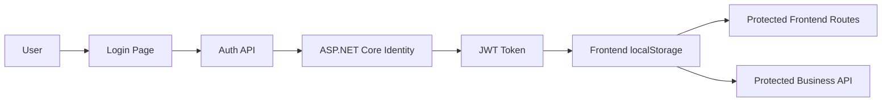
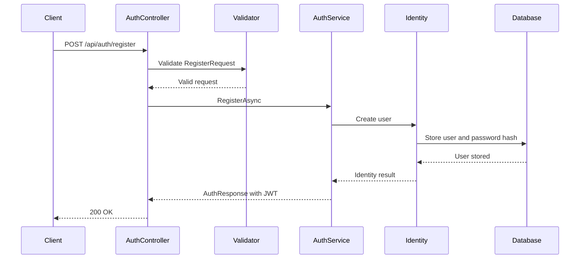
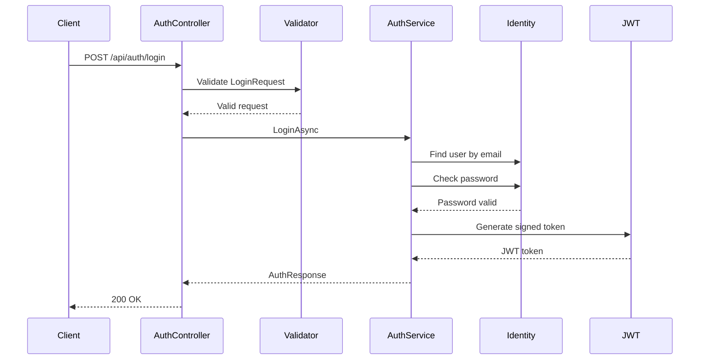
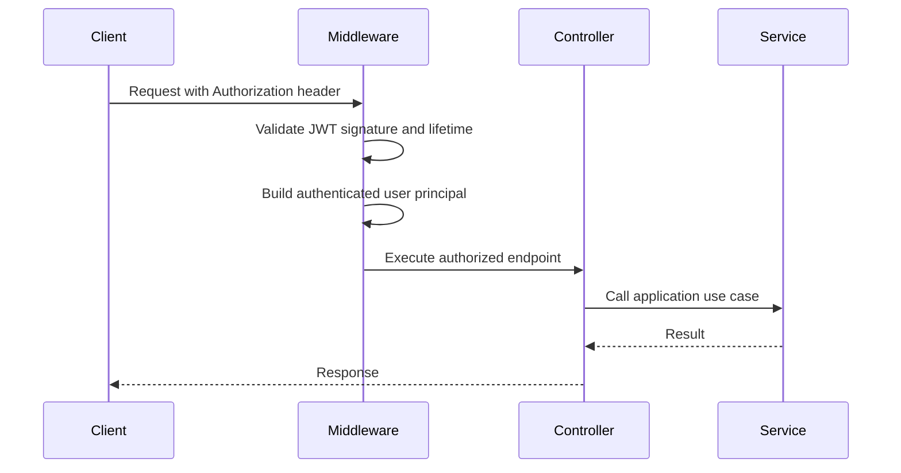
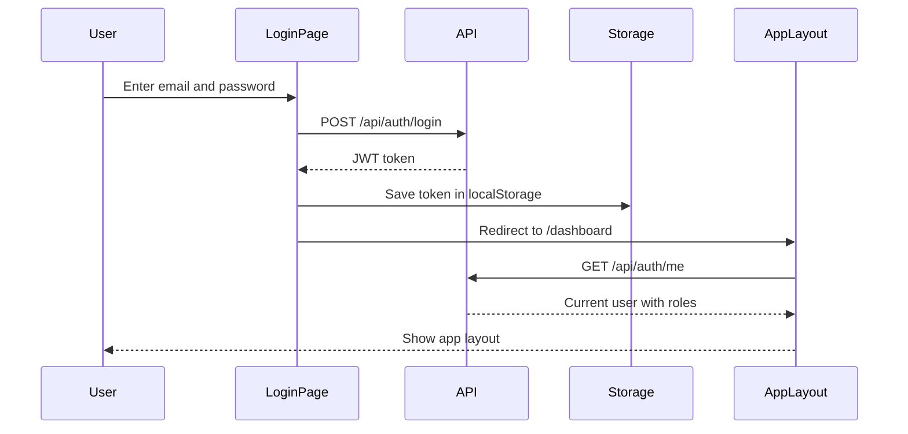
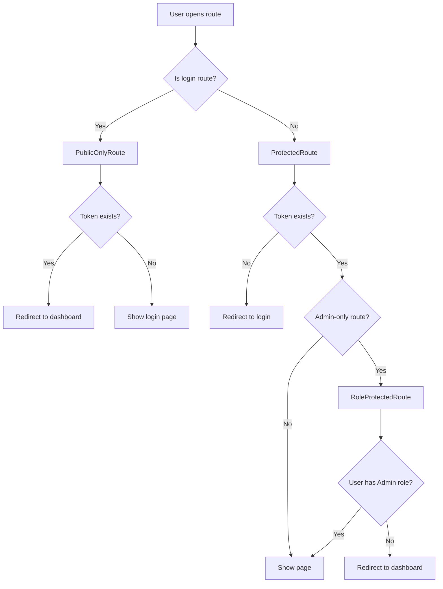

# Authentication Architecture

This document explains how authentication and authorization are implemented in the Gartenzwerge management application.

The backend is the real security boundary. The frontend uses route guards to improve user experience, but all protected business operations must still be enforced by the API.

---

## Goal

The authentication system allows users to:

* register an account
* log in with email and password
* receive a JWT token
* access protected API endpoints
* load the current authenticated user
* use role-based access based on Admin or Employee permissions

---

## Technologies Used

| Technology                 | Responsibility                       |
| -------------------------- | ------------------------------------ |
| ASP.NET Core Identity      | User management and password hashing |
| Entity Framework Core      | Identity persistence                 |
| PostgreSQL                 | Database storage                     |
| JWT Bearer Authentication  | Token-based API authentication       |
| ASP.NET Core Authorization | Endpoint protection                  |
| FluentValidation           | Auth request validation              |
| Swagger JWT Authorization  | Testing protected endpoints locally  |
| React Router               | Frontend route protection            |
| localStorage               | Current development JWT storage      |

---

## High-Level Flow



---

## Main Backend Components

### ApplicationUser

`ApplicationUser` extends ASP.NET Core Identity's `IdentityUser<Guid>`.

It represents an application user inside the Identity system.

```text
ApplicationUser : IdentityUser<Guid>
```

Project-specific user fields can be added here later.

---

### Auth DTOs

The Application layer defines authentication request and response DTOs.

Examples:

| DTO               | Purpose                                          |
| ----------------- | ------------------------------------------------ |
| `RegisterRequest` | Input for user registration                      |
| `LoginRequest`    | Input for user login                             |
| `AuthResponse`    | Authentication response with token and user data |

These DTOs define the input and output of authentication use cases without exposing Identity implementation details to the API layer.

---

### IAuthService

`IAuthService` is defined in the Application layer.

It describes the authentication use cases:

* register a user
* log in a user

The Application layer depends on this abstraction and does not need to know how ASP.NET Core Identity or JWT token generation work internally.

---

### AuthService

`AuthService` is implemented in the Infrastructure layer.

It uses technical dependencies such as:

* `UserManager<ApplicationUser>`
* ASP.NET Core Identity
* JWT token generation
* application configuration
* role information

This keeps Identity and JWT implementation details outside the Application layer.

---

### AuthController

`AuthController` exposes authentication through HTTP endpoints.

```http
POST /api/auth/register
POST /api/auth/login
GET  /api/auth/me
```

The controller stays thin and delegates authentication logic to `IAuthService`.

---

## Register Flow



---

## Login Flow



---

## Authenticated API Request Flow



Authenticated requests must include the token in the `Authorization` header.

```http
Authorization: Bearer <token>
```

---

## Current User Flow

The frontend loads the current user through:

```http
GET /api/auth/me
```

This endpoint requires a valid JWT bearer token.

Example response:

```json
{
  "userId": "00000000-0000-0000-0000-000000000000",
  "email": "test@gartenzwerge.de",
  "displayName": "Test User",
  "roles": ["Admin"]
}
```

The frontend uses this information to display the current user and to improve role-aware navigation.

Example header display:

```text
test@gartenzwerge.de · Admin
```

---

## JWT Token

The JWT token contains claims about the authenticated user.

Current claims include:

| Claim        | Purpose                           |
| ------------ | --------------------------------- |
| User id      | Identifies the authenticated user |
| Email        | Identifies the user by email      |
| Display name | User-facing display value         |
| Role claims  | Used for role-based authorization |
| Token id     | Unique token identifier           |

The token is signed using a secret key from configuration.

If the token is modified, the signature becomes invalid and the API rejects the request.

---

## Role-Based Authorization

The backend uses ASP.NET Core Identity roles for role-based authorization.

Available roles:

| Role     | Purpose                                           |
| -------- | ------------------------------------------------- |
| Admin    | Full management access including critical actions |
| Employee | Regular business workflow access                  |

Roles are seeded during application startup for local development.

Development users:

| User                       | Role     |
| -------------------------- | -------- |
| `test@gartenzwerge.de`     | Admin    |
| `employee@gartenzwerge.de` | Employee |

JWT tokens include role claims so ASP.NET Core can evaluate role-based authorization rules.

Example:

```csharp
[Authorize(Roles = ApplicationRoles.Admin)]
```

---

## Authorization Behavior

| Situation                             | Response             |
| ------------------------------------- | -------------------- |
| Missing token                         | `401 Unauthorized`   |
| Invalid token                         | `401 Unauthorized`   |
| Expired token                         | `401 Unauthorized`   |
| Valid token but missing required role | `403 Forbidden`      |
| Valid token with required role        | Endpoint is executed |

In short:

```text
401 Unauthorized
→ the request is not authenticated

403 Forbidden
→ the request is authenticated but not allowed
```

---

## Role Permissions

| Area                                  | Employee | Admin |
| ------------------------------------- | -------- | ----- |
| Customers read/create/update          | Yes      | Yes   |
| Customers delete                      | No       | Yes   |
| Offered Services read                 | Yes      | Yes   |
| Offered Services create/update/delete | No       | Yes   |
| Offers read/create/update             | Yes      | Yes   |
| Offers delete                         | No       | Yes   |
| Offer Items read/create/update/delete | Yes      | Yes   |
| Orders read/create/update             | Yes      | Yes   |
| Orders delete                         | No       | Yes   |
| Analytics frontend area               | No       | Yes   |
| Offered Services frontend area        | No       | Yes   |

---

## Frontend Authentication Flow

The frontend authentication flow works as follows:



---

## Frontend Token Storage

The current frontend stores the JWT token in browser `localStorage`.

Responsibilities:

| Function              | Purpose                                |
| --------------------- | -------------------------------------- |
| Save token            | Store token after successful login     |
| Read token            | Attach token to protected API requests |
| Remove token          | Clear token on logout                  |
| Check token existence | Decide whether a route can be opened   |

This is sufficient for the current development stage. A future production version may use a more advanced token strategy.

---

## Frontend Route Protection

The frontend uses three route guard components.

| Component            | Responsibility                                      |
| -------------------- | --------------------------------------------------- |
| `ProtectedRoute`     | Protect internal app routes for authenticated users |
| `PublicOnlyRoute`    | Prevent authenticated users from opening `/login`   |
| `RoleProtectedRoute` | Protect Admin-only frontend routes                  |

---

## Frontend Route Guard Flow



Frontend route protection is not a replacement for backend authorization. It only improves the user experience.

---

## Protected Frontend Routes

Authenticated users can access:

```text
/dashboard
/customers
/offers
/offers/new
/offers/:offerId
/orders
/orders/:orderId
/more
```

Admin-only frontend routes:

```text
/analytics
/offered-services
```

Public-only route:

```text
/login
```

---

## Security Decisions

### Same login error message

The login endpoint returns the same error message for unknown emails and wrong passwords.

```text
Invalid email or password.
```

This prevents attackers from discovering whether a specific email address exists.

---

### Password hashing

Passwords are not stored as plain text.

ASP.NET Core Identity hashes passwords before storing them in the database.

The application does not manually set `PasswordHash`.

---

### Signed JWT tokens

The JWT secret is used to sign tokens.

If someone modifies a token, the signature becomes invalid and the API rejects the request.

---

### Backend as security boundary

The frontend may hide or redirect UI routes, but the backend must always enforce authentication and authorization.

For example, Admin-only frontend routes improve navigation, but Admin-only API endpoints still need backend role checks.

---

## Current Implementation Status

| Feature                                           | Status      |
| ------------------------------------------------- | ----------- |
| User registration                                 | Implemented |
| User login                                        | Implemented |
| Password hashing through Identity                 | Implemented |
| JWT token generation                              | Implemented |
| JWT bearer authentication                         | Implemented |
| Role claims in JWT tokens                         | Implemented |
| Admin and Employee roles                          | Implemented |
| Role seeding for local development                | Implemented |
| Development users for local authorization testing | Implemented |
| Protected `/api/auth/me` endpoint                 | Implemented |
| Protected business endpoints                      | Implemented |
| Role-based endpoint protection                    | Implemented |
| Swagger JWT authorization                         | Implemented |
| Auth request validation                           | Implemented |
| Frontend login flow                               | Implemented |
| Frontend protected routes                         | Implemented |
| Frontend role-aware navigation                    | Implemented |

---

## Current Limitations

| Limitation                                 | Notes                                                          |
| ------------------------------------------ | -------------------------------------------------------------- |
| No customer user role yet                  | A future customer portal may require this                      |
| No user management endpoints               | Runtime user administration is not implemented                 |
| No runtime role assignment through the API | Roles are currently seeded for local development               |
| No custom authorization policies yet       | Role-based authorization is sufficient for now                 |
| No refresh tokens                          | Token refresh is not implemented                               |
| No password reset flow                     | Not needed for the current portfolio stage                     |
| No email confirmation                      | Not implemented yet                                            |
| Token is stored in localStorage            | Acceptable for current development, but can be revisited later |

---

## Related Documentation

* [API Endpoints](../api/endpoints.md)
* [Frontend Architecture](../frontend/frontend-architecture.md)
* [Identity Schema](../database/identity-schema.md)
* [Request Flow](request-flow.md)
* [Clean Architecture](clean-architecture.md)
