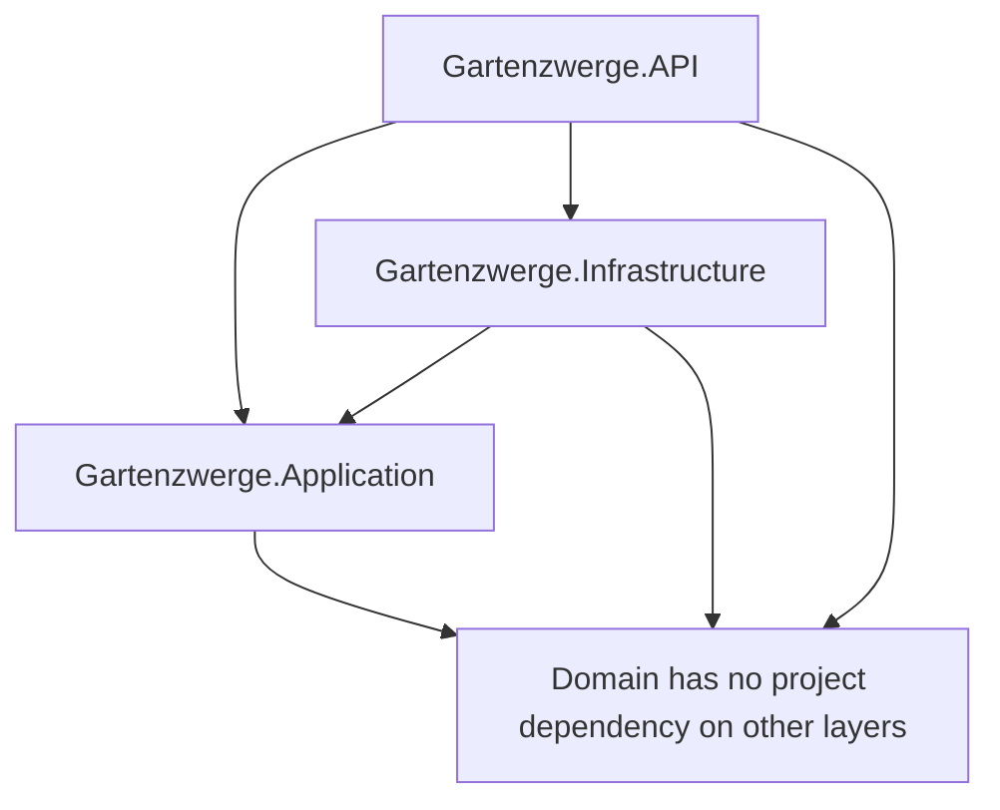
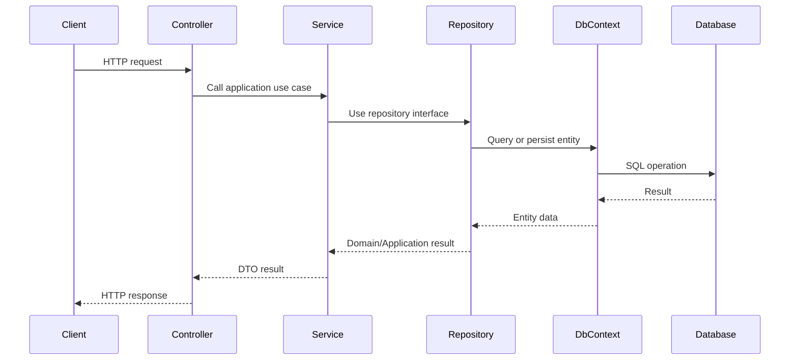

# Clean Architecture

This document explains how Clean Architecture is applied in the Gartenzwerge backend.

The goal is to keep business logic independent from technical details such as databases, web frameworks, Identity, JWT handling or external systems.

---

## Goal

The application should be easy to extend, test and maintain.

Core business logic belongs to the inner layers, while technical implementation details belong to the outer layers.

```text
Business rules should not depend on technical details.
Technical details should depend on business rules.
```

---

## Backend Projects

The backend is separated into four main projects:

```text
Gartenzwerge.Domain
Gartenzwerge.Application
Gartenzwerge.Infrastructure
Gartenzwerge.API
```

---

## Dependency Direction

The dependency direction points inward.



The most important rule:

```text
Domain does not depend on anything.
Application depends on Domain.
Infrastructure depends on Application and Domain.
API wires everything together.
```

---

## Layer Overview

| Layer          | Project                       | Main responsibility                                                           |
| -------------- | ----------------------------- | ----------------------------------------------------------------------------- |
| Domain         | `Gartenzwerge.Domain`         | Core business entities and enums                                              |
| Application    | `Gartenzwerge.Application`    | Use cases, business rules, DTOs, validators and interfaces                    |
| Infrastructure | `Gartenzwerge.Infrastructure` | Database, repositories, Identity, JWT and technical implementations           |
| API            | `Gartenzwerge.API`            | HTTP endpoints, middleware, dependency injection and authorization attributes |

---

# Domain Layer

Project:

```text
Gartenzwerge.Domain
```

The Domain layer contains the core business concepts.

## Responsibilities

| Responsibility     | Examples                                                    |
| ------------------ | ----------------------------------------------------------- |
| Business entities  | `Customer`, `OfferedService`, `Offer`, `OfferItem`, `Order` |
| Business enums     | `OfferStatus`, `OrderStatus`                                |
| Shared entity base | `BaseEntity`                                                |
| Domain state       | IDs, timestamps, soft-delete flags and entity properties    |

## Current Domain Concepts

| Concept        | Meaning                                              |
| -------------- | ---------------------------------------------------- |
| Customer       | Person or company receiving the service              |
| OfferedService | Reusable service with unit and base price            |
| Offer          | Sales document for a customer                        |
| OfferItem      | Service position inside an offer                     |
| Order          | Operational work item created from an accepted offer |
| OfferStatus    | Draft, Sent, Accepted, Rejected                      |
| OrderStatus    | Planned, InProgress, Completed, Cancelled            |

The Domain layer should not contain:

* database access
* controller logic
* HTTP concerns
* Entity Framework configuration
* JWT generation
* ASP.NET Core Identity details

---

# Application Layer

Project:

```text
Gartenzwerge.Application
```

The Application layer contains use cases and business rules.

## Responsibilities

| Responsibility          | Examples                                                          |
| ----------------------- | ----------------------------------------------------------------- |
| DTOs                    | Request and response models                                       |
| Validators              | FluentValidation request validation                               |
| Service interfaces      | `ICustomerService`, `IOfferService`, `IOrderService`              |
| Service implementations | Application use cases                                             |
| Repository interfaces   | Abstractions for persistence                                      |
| Application exceptions  | `NotFoundException`, `ConflictException`, `UnauthorizedException` |
| Authorization constants | `ApplicationRoles`                                                |

## Current Use Cases

Examples of current application use cases:

* create customers
* update customers
* create offered services
* create offers
* update offer status
* add offer items
* update offer item quantities
* recalculate offer totals
* create orders from accepted offers
* prevent duplicate orders
* update orders
* register users
* log in users

## Business Rules

Important business rules currently live in the Application layer.

| Rule                                                          | Reason                                                    |
| ------------------------------------------------------------- | --------------------------------------------------------- |
| An order can only be created from an accepted offer           | Prevents draft or rejected offers from becoming real work |
| Each offer can only have one order                            | Prevents duplicate order creation                         |
| Offer totals are recalculated from active offer items         | Keeps totals consistent                                   |
| Offer item totals are calculated from quantity and unit price | Keeps pricing logic centralized                           |
| `completedAt` is set when an order is completed               | Keeps order lifecycle data consistent                     |
| `completedAt` is cleared when an order is reopened            | Prevents stale completion data                            |
| Duplicate user registration is prevented                      | Protects account uniqueness                               |
| Invalid login attempts return the same error message          | Avoids leaking whether an email exists                    |

---

# Infrastructure Layer

Project:

```text
Gartenzwerge.Infrastructure
```

The Infrastructure layer contains technical implementations.

## Responsibilities

| Responsibility             | Examples                              |
| -------------------------- | ------------------------------------- |
| Database access            | Entity Framework Core, PostgreSQL     |
| DbContext                  | `AppDbContext`                        |
| Repository implementations | Concrete database-backed repositories |
| Database migrations        | EF Core migrations                    |
| Identity implementation    | ASP.NET Core Identity                 |
| Application user           | `ApplicationUser`                     |
| Role storage and seeding   | Identity roles, development users     |
| JWT token generation       | Signed JWT tokens with claims         |
| Dependency injection       | Infrastructure service registration   |

## Why Infrastructure Is Separate

The Application layer defines interfaces such as repositories or authentication services.

The Infrastructure layer implements them.

Example:

```text
Application:
IOrderRepository
IAuthService

Infrastructure:
OrderRepository
AuthService
AppDbContext
ASP.NET Core Identity
JWT token generation
```

This keeps application logic independent from Entity Framework Core, PostgreSQL, ASP.NET Core Identity and JWT implementation details.

---

# API Layer

Project:

```text
Gartenzwerge.API
```

The API layer exposes the application through HTTP endpoints.

## Responsibilities

| Responsibility       | Examples                                                                        |
| -------------------- | ------------------------------------------------------------------------------- |
| Controllers          | `CustomersController`, `OffersController`, `OrdersController`, `AuthController` |
| Request handling     | Route parameters and request bodies                                             |
| Response handling    | HTTP status codes and response models                                           |
| Middleware           | Global exception handling                                                       |
| Dependency injection | Register Application and Infrastructure services                                |
| Authentication setup | JWT bearer authentication                                                       |
| Authorization setup  | Role-based endpoint protection                                                  |
| Swagger              | OpenAPI and JWT authorization support                                           |

Controllers should stay thin.

They should:

* receive HTTP requests
* delegate work to application services
* return HTTP responses

They should not contain core business rules.

---

## Controller Authorization

Role-based endpoint access is enforced in the API layer with ASP.NET Core authorization attributes.

Examples:

```csharp
[Authorize(Roles = ApplicationRoles.AdminOrEmployee)]
[Authorize(Roles = ApplicationRoles.Admin)]
```

The role names are defined in the Application layer, but ASP.NET Core authorization enforcement happens in the API layer.

---

# Request Flow

A typical business request flows through the application like this:



---

## Example: Add Offer Item

```text
POST /api/offers/{offerId}/items
 ↓
OfferItemsController
 ↓
CreateOfferItemRequestValidator
 ↓
OfferItemService
 ↓
IOfferRepository / IOfferedServiceRepository
 ↓
OfferRepository / OfferedServiceRepository
 ↓
AppDbContext
 ↓
PostgreSQL
```

Business behavior:

* load the offer
* load the selected offered service
* create an offer item
* copy unit and unit price from the offered service
* calculate item total
* recalculate offer total

---

## Example: Create Order From Offer

```text
POST /api/offers/{offerId}/order
 ↓
OrdersController
 ↓
CreateOrderFromOfferRequestValidator
 ↓
OrderService
 ↓
IOfferRepository / IOrderRepository
 ↓
OfferRepository / OrderRepository
 ↓
AppDbContext
 ↓
PostgreSQL
```

Business behavior:

* load the offer
* check that the offer exists
* check that the offer is accepted
* check that no order already exists for the offer
* create a new order with status `Planned`
* copy `OfferId` and `CustomerId` from the offer

---

## Example: Login

```text
POST /api/auth/login
 ↓
AuthController
 ↓
LoginRequestValidator
 ↓
IAuthService
 ↓
AuthService
 ↓
UserManager<ApplicationUser>
 ↓
ASP.NET Core Identity
 ↓
JWT token response
```

Authentication uses the same architectural idea:

```text
Application defines IAuthService.
Infrastructure implements AuthService using Identity and JWT.
API exposes the HTTP endpoint.
```

---

# Repository Pattern

Repositories separate business logic from database access.

The Application layer depends on repository interfaces, not on Entity Framework Core.

Example:

```text
OrderService depends on IOrderRepository.
OrderService does not depend on AppDbContext.
```

This makes services easier to understand and test, because database details are not mixed into business use cases.

---

# Validation

Request validation is handled with FluentValidation.

Validators live in the Application layer because they protect application use cases from invalid input.

Examples:

* customer request validation
* offered service request validation
* offer request validation
* offer item request validation
* order request validation
* register request validation
* login request validation

Invalid request bodies return:

```http
400 Bad Request
```

---

# Exception Handling

The application uses custom exceptions for expected business errors.

| Exception               | HTTP response               |
| ----------------------- | --------------------------- |
| `NotFoundException`     | `404 Not Found`             |
| `UnauthorizedException` | `401 Unauthorized`          |
| `ConflictException`     | `409 Conflict`              |
| `Unexpected exception`    | `500 Internal Server Error` |

Some authentication and authorization responses are produced directly by ASP.NET Core middleware.

| Case                              | HTTP response      |
| --------------------------------- | ------------------ |
| Missing or invalid JWT token      | `401 Unauthorized` |
| Valid token but insufficient role | `403 Forbidden`    |

This keeps controllers clean because they do not need to handle every error case manually.

---

# Soft Delete

Some entities are soft-deleted instead of physically removed from the database.

Soft delete means:

```text
IsDeleted = true
DeletedAt = timestamp
```

This keeps historical data in the database while hiding deleted records from normal queries.

Currently used for:

* customers
* offered services
* offers
* offer items
* orders

---

# Benefits

This architecture provides several benefits:

| Benefit                                            | Why it matters                                            |
| -------------------------------------------------- | --------------------------------------------------------- |
| Business logic is separated from technical details | Easier to maintain and extend                             |
| Controllers stay thin                              | HTTP logic does not hide business rules                   |
| Database access is isolated                        | Application code is not tied directly to EF Core          |
| Business rules are easier to find                  | Use cases live in the Application layer                   |
| Testing becomes easier                             | Application services can be tested without full API setup |
| Identity and JWT details stay outside Application  | Authentication implementation remains replaceable         |
| Role names are centralized                         | Avoids duplicated magic strings                           |
| New features follow a consistent structure         | The project can grow predictably                          |

---

# Rule of Thumb

Use this rule when deciding where code belongs:

| Question                                             | Layer          |
| ---------------------------------------------------- | -------------- |
| Is it an entity or enum?                             | Domain         |
| Is it a use case, DTO, validator or interface?       | Application    |
| Is it a role constant?                               | Application    |
| Is it database, Identity or JWT implementation?      | Infrastructure |
| Is it role seeding or JWT role claim generation?     | Infrastructure |
| Is it an HTTP endpoint, middleware or Swagger setup? | API            |
| Is it a controller authorization attribute?          | API            |

---

# Related Documentation

* [Authentication Architecture](authentication.md)
* [Request Flow](request-flow.md)
* [API Endpoints](../api/endpoints.md)
* [Entity Relationships](../database/entity-relationships.md)
* [Offer-to-Order Workflow](../business-processes/offer-to-order-workflow.md)
* [Create Order From Offer Flow](../business-processes/create-order-from-offer-flow.md)
* [Add Offer Item Flow](../business-processes/add-offer-item-flow.md)
