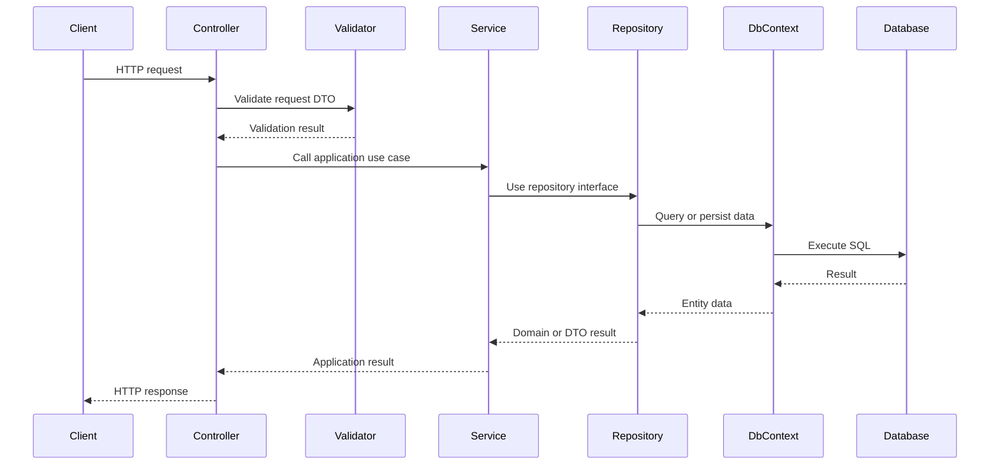
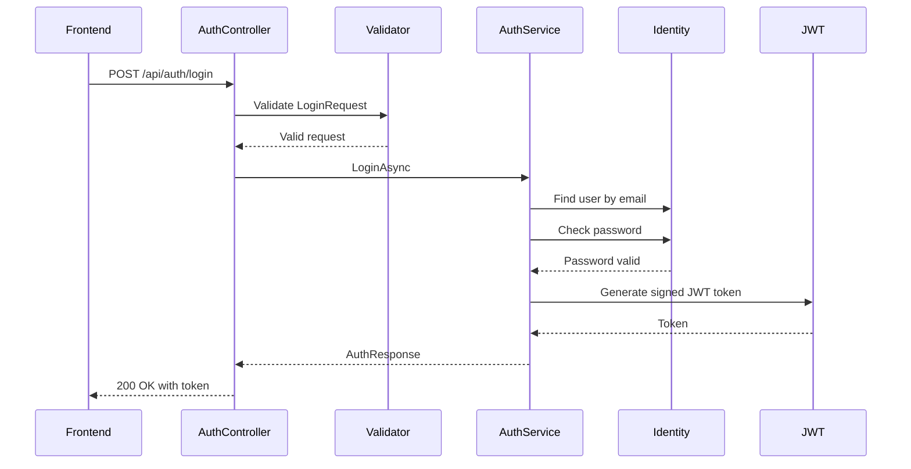
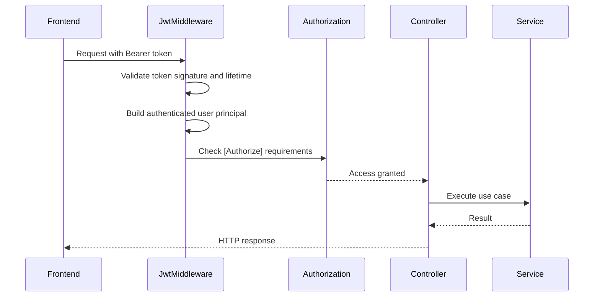
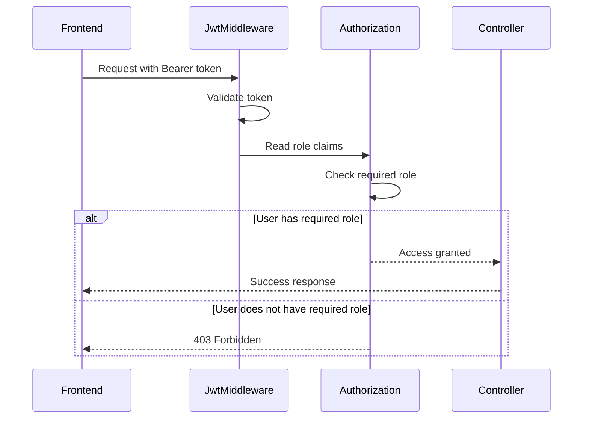
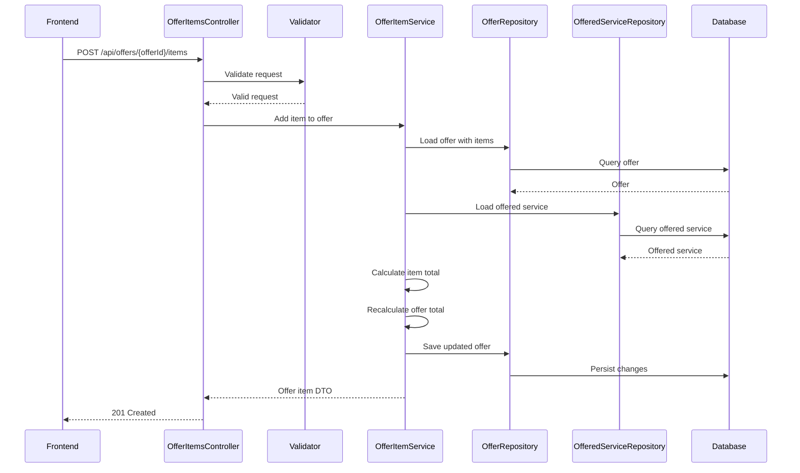
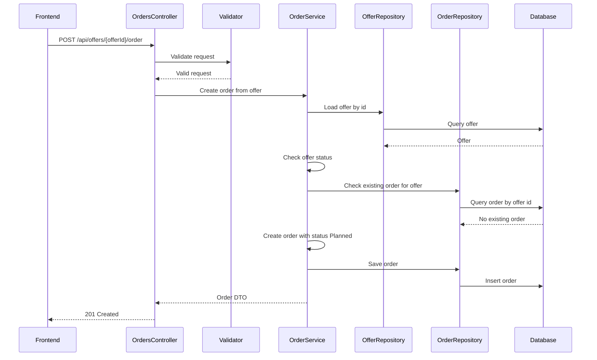
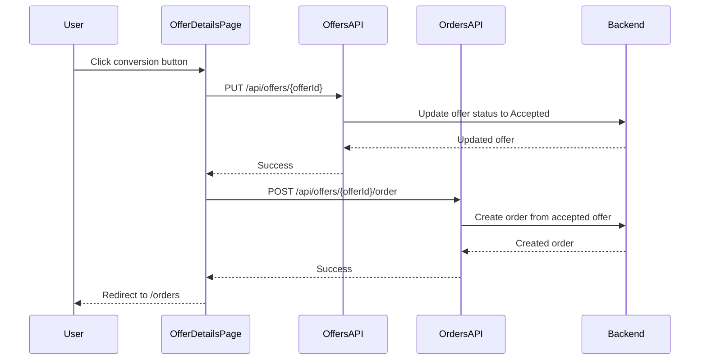
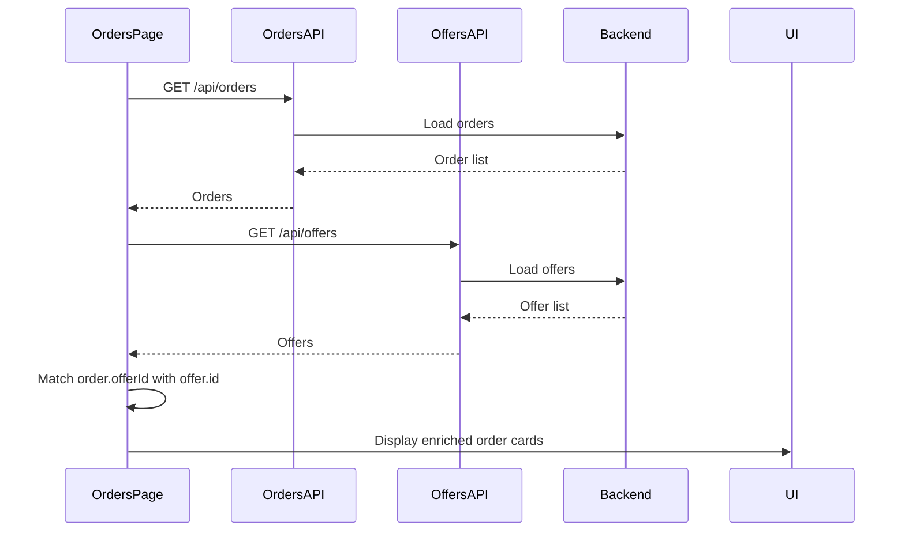
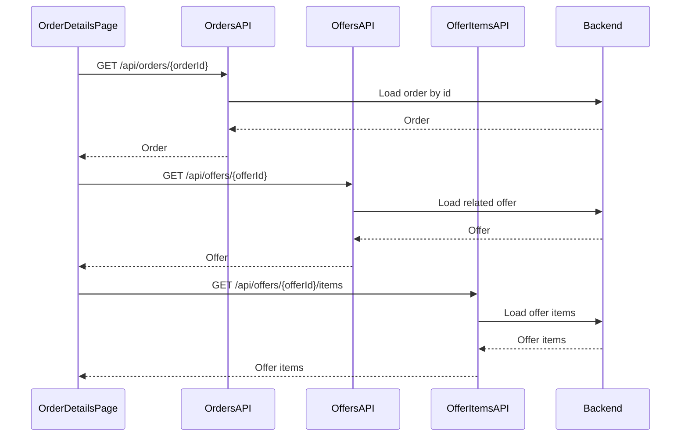
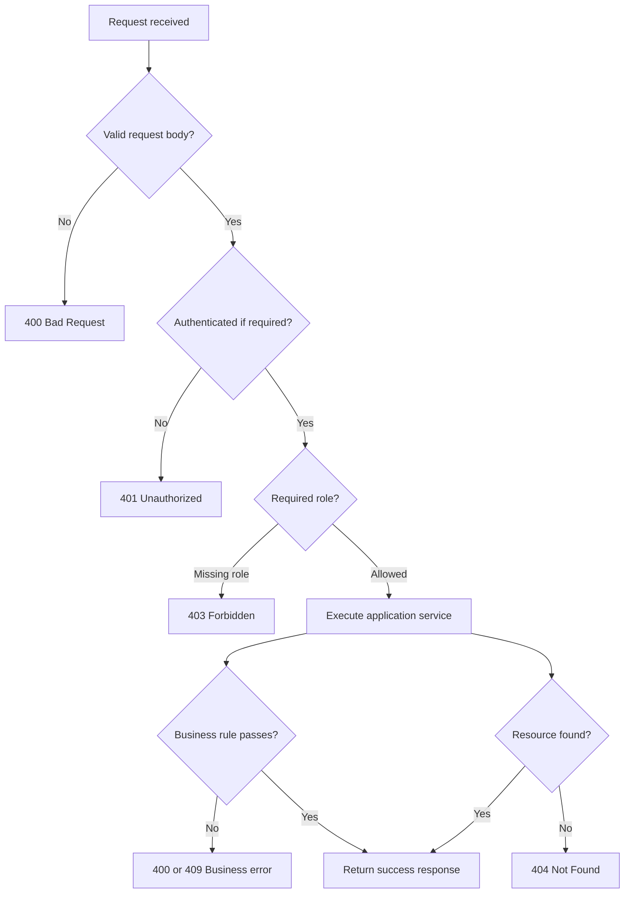

# Request Flow

This document explains how requests flow through the Gartenzwerge management application.

It focuses on the interaction between frontend, API, application services, repositories and the database.

---

## Goal

The goal of this document is to make the runtime behavior of the application understandable.

It shows how a request moves through the system and which layer is responsible for which part of the work.

---

## General Backend Request Flow

A typical backend API request follows this structure:

```text
HTTP Request
→ Controller
→ FluentValidation
→ Application Service
→ Repository Interface
→ Repository Implementation
→ Entity Framework Core
→ PostgreSQL
→ HTTP Response
```

Visualized as a sequence:



---

## Layer Responsibilities

| Layer          | Responsibility                                                  |
| -------------- | --------------------------------------------------------------- |
| Frontend       | Calls API endpoints and displays user-facing state              |
| API            | Receives HTTP requests and returns HTTP responses               |
| Application    | Executes use cases and business rules                           |
| Domain         | Contains core entities and enums                                |
| Infrastructure | Implements persistence, Identity and external technical details |
| Database       | Stores application data                                         |

---

## Authentication Request Flow

Authentication requests are public for registration and login, but still pass through validation and application services.

### Login Flow



After a successful login, the frontend stores the JWT token and redirects the user to the protected app area.

```text
Login success
→ token stored in localStorage
→ redirect to /dashboard
→ load current user through /api/auth/me
```

---

## Authenticated Request Flow

Protected requests require a valid JWT bearer token.

```http
Authorization: Bearer <token>
```



If the token is missing or invalid, the request does not reach the controller action.

---

## Role-Based Request Flow

Some endpoints require a specific role.

Example:

```csharp
[Authorize(Roles = ApplicationRoles.Admin)]
```



Authorization behavior:

| Situation                             | Response                      |
| ------------------------------------- | ----------------------------- |
| Missing token                         | `401 Unauthorized`            |
| Invalid token                         | `401 Unauthorized`            |
| Valid token but missing required role | `403 Forbidden`               |
| Valid token with required role        | Controller action is executed |

---

# Business Flow Examples

## Example 1: Add Offer Item

Endpoint:

```http
POST /api/offers/{offerId}/items
```

This request adds a service position to an existing offer.

### Request Body

```json
{
  "offeredServiceId": "00000000-0000-0000-0000-000000000000",
  "quantity": 250
}
```

### Flow



### Business Rules

| Rule                                           | Purpose                                      |
| ---------------------------------------------- | -------------------------------------------- |
| Offer must exist                               | Items can only be added to existing offers   |
| Offered service must exist                     | Item pricing depends on the selected service |
| Quantity must be greater than zero             | Prevents invalid totals                      |
| Item total is calculated by the backend        | Backend remains source of truth              |
| Offer total is recalculated after item changes | Keeps offer totals consistent                |

---

## Example 2: Create Order From Offer

Endpoint:

```http
POST /api/offers/{offerId}/order
```

This request creates a new order from an accepted offer.

The current frontend sends an empty JSON object because order creation is based on the accepted offer.

```json
{}
```

### Flow



### Business Rules

| Rule                                                 | Purpose                                                      |
| ---------------------------------------------------- | ------------------------------------------------------------ |
| Offer must exist                                     | Orders can only be created from real offers                  |
| Offer must be accepted                               | Prevents draft, sent or rejected offers from becoming orders |
| Only one order per offer is allowed                  | Prevents duplicate operational work                          |
| New orders start as `Planned`                        | Establishes a clear order lifecycle                          |
| `OfferId` and `CustomerId` are copied from the offer | Maintains business traceability                              |

---

## Example 3: Offer Acceptance and Order Conversion from Frontend

The frontend intentionally uses an explicit conversion action instead of silently creating an order when the status changes.

User action:

```text
Angebot annehmen & Auftrag erstellen
```

### Flow



If an order already exists for the offer, the frontend does not show the creation button and links to the existing order instead.

---

## Example 4: Load Orders Overview

Route:

```text
/orders
```

The current `OrderDto` is intentionally lightweight. It does not contain all display data needed by the frontend.

Therefore, the frontend loads orders and offers, then combines them for display.

### Flow



### Display Data Sources

| Displayed information | Source        |
| --------------------- | ------------- |
| Order status          | Order         |
| Planned date          | Order         |
| Completed date        | Order         |
| Customer name         | Related offer |
| Offer number          | Related offer |
| Total amount          | Related offer |

This keeps the order API simple while still making the frontend useful.

---

## Example 5: Load Order Details

Route:

```text
/orders/:orderId
```

The order details page is currently read-only.

### Flow



The page displays:

* order data
* related offer foundation
* original offer items
* links back to the order overview and related offer

---

# Error Handling Flow

The API uses validation, application exceptions and ASP.NET Core middleware to return meaningful HTTP responses.



---

## Common Error Responses

| Error source              | Example                      | Response                            |
| ------------------------- | ---------------------------- | ----------------------------------- |
| Validation                | Empty required field         | `400 Bad Request`                   |
| Authentication middleware | Missing or invalid token     | `401 Unauthorized`                  |
| Authorization middleware  | Valid token but missing role | `403 Forbidden`                     |
| Application service       | Resource does not exist      | `404 Not Found`                     |
| Application service       | Duplicate order for offer    | `409 Conflict`                      |
| Application service       | Business rule violation      | `400 Bad Request` or `409 Conflict` |
| Unexpected error          | Unhandled exception          | `500 Internal Server Error`         |

---

# Success Responses

| Response         | Typical use                                 |
| ---------------- | ------------------------------------------- |
| `200 OK`         | Read or update succeeded                    |
| `201 Created`    | Resource was created                        |
| `204 No Content` | Resource was deleted or no body is returned |

---

# Key Principles

| Principle                          | Meaning                                                  |
| ---------------------------------- | -------------------------------------------------------- |
| Controllers stay thin              | Controllers delegate work to application services        |
| Business rules live in Application | Core decisions are not hidden in controllers             |
| Repositories handle persistence    | Database logic is separated from use cases               |
| Backend is source of truth         | Frontend improves UX but does not enforce security alone |
| Validation protects use cases      | Invalid input is rejected before business logic runs     |
| Errors are mapped consistently     | Expected failures become meaningful HTTP responses       |

---

# Related Documentation

* [Clean Architecture](clean-architecture.md)
* [Authentication Architecture](authentication.md)
* [API Endpoints](../api/endpoints.md)
* [Offer-to-Order Workflow](../business-processes/offer-to-order-workflow.md)
* [Create Order From Offer Flow](../business-processes/create-order-from-offer-flow.md)
* [Add Offer Item Flow](../business-processes/add-offer-item-flow.md)
