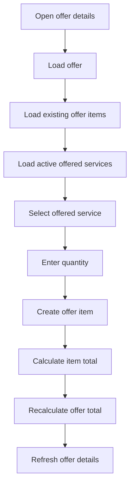

# Add Offer Item Flow

This document describes how offer items are added to an existing offer.

Offer items represent the individual service positions of an offer, such as lawn mowing, hedge cutting or green waste disposal. They connect an offer with an offered service and calculate the position total from quantity and unit price.

---

## Purpose

The add offer item flow allows users to build a complete offer from reusable offered services.

```text
Offer
→ Offer Item
→ Offered Service
→ Quantity
→ Item Total
→ Updated Offer Total
```

This keeps pricing consistent and avoids manually entering prices for every offer position.

---

## Business Flow



---

## Involved Concepts

| Concept        | Responsibility                                    |
| -------------- | ------------------------------------------------- |
| Offer          | The sales document for a customer                 |
| OfferedService | A reusable service with name, unit and base price |
| OfferItem      | A single position inside an offer                 |
| Quantity       | The amount of the selected service                |
| UnitPrice      | The price copied from the offered service         |
| TotalPrice     | Calculated item total                             |
| TotalNet       | Updated total amount of the offer                 |

---

## Preconditions

Before an offer item can be added:

| Requirement                                   | Reason                                  |
| --------------------------------------------- | --------------------------------------- |
| The user must be authenticated                | Business endpoints are protected        |
| The user must have the Admin or Employee role | Offer item management is role-protected |
| The offer must exist                          | Offer items belong to an offer          |
| The offered service must exist                | The item is based on a service          |
| The offered service should be active          | The frontend only shows active services |
| The quantity must be valid                    | Item totals depend on quantity          |

---

## API Endpoint

```http
POST /api/offers/{offerId}/items
```

Example request:

```json
{
  "offeredServiceId": "00000000-0000-0000-0000-000000000000",
  "quantity": 10
}
```

Example response:

```json
{
  "id": "00000000-0000-0000-0000-000000000000",
  "offerId": "00000000-0000-0000-0000-000000000000",
  "offeredServiceId": "00000000-0000-0000-0000-000000000000",
  "description": "Lawn mowing",
  "quantity": 10,
  "unit": "m²",
  "unitPrice": 0.35,
  "totalPrice": 3.50
}
```

---

## Frontend Flow

The current frontend implementation is located on:

```text
/offers/:offerId
```

The page performs the following steps:

| Step | Frontend behavior                         |
| ---- | ----------------------------------------- |
| 1    | Load offer details                        |
| 2    | Load existing offer items                 |
| 3    | Load offered services                     |
| 4    | Filter active offered services            |
| 5    | Display a form for service and quantity   |
| 6    | Submit `POST /api/offers/{offerId}/items` |
| 7    | Reset the form after success              |
| 8    | Reload offer details and offer items      |
| 9    | Display the updated offer total           |

---

## Calculation Logic

The backend calculates the item total based on the selected offered service and the entered quantity.

```text
Item Total = Quantity × Unit Price
```

The offer total is recalculated after item changes.

```text
Offer Total = Sum of active offer item totals
```

The frontend does not calculate the final offer total as source of truth. It refreshes the offer from the backend after adding a new item.

---

## Read-Only Behavior

The frontend prevents item changes when an offer is no longer editable.

An offer becomes read-only when:

| Condition            | Reason                                             |
| -------------------- | -------------------------------------------------- |
| Offer is accepted    | The offer has been confirmed                       |
| Offer is rejected    | The offer is no longer active                      |
| Related order exists | The offer has already been converted into an order |

This protects the offer as a historical business document after order conversion.

---

## Current Limitations

| Limitation                                              | Notes                                                          |
| ------------------------------------------------------- | -------------------------------------------------------------- |
| Offer item editing is not fully exposed in the frontend | Backend support exists, but the current UI focuses on creation |
| Offer item deletion is not exposed in the frontend yet  | Backend support exists                                         |
| Active offered services are filtered client-side        | This is acceptable for the current project size                |
| No advanced pricing assistant yet                       | Planned for a later milestone                                  |

---

## Future Improvements

Possible future improvements:

* edit offer item quantities in the frontend
* remove offer items before acceptance
* show a clearer item subtotal section
* add pricing hints based on service type
* add AI-assisted offer item suggestions
* add PDF generation for finalized offers

---

## Related Documentation

* [Offer-to-Order Workflow](offer-to-order-workflow.md)
* [Create Order From Offer Flow](create-order-from-offer-flow.md)
* [API Endpoints](../api/endpoints.md)
* [Frontend Architecture](../frontend/frontend-architecture.md)
