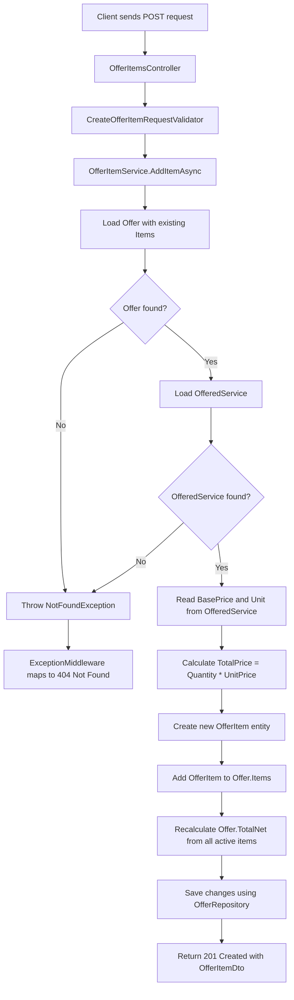

# Add Offer Item Flow

This document describes the business and technical flow for adding a new offer item to an existing offer.

The feature is exposed through the following API endpoint:

```http
POST /api/offers/{offerId}/items
```

---

## Purpose

An offer item represents a single service position inside an offer.

Examples:

* Lawn mowing
* Hedge cutting
* Green waste disposal
* Pressure washing

An offer can contain multiple offer items.
The total value of the offer is calculated from the sum of all active offer items.

---

## Business Rule

The client is only allowed to send the selected offered service and the quantity.

The backend is responsible for:

* Loading the selected offered service
* Using the stored base price as the unit price
* Calculating the item total price
* Adding the item to the offer
* Recalculating the offer total value

This prevents clients from manipulating prices directly.

---

## Request

```http
POST /api/offers/{offerId}/items
```

### Route parameter

```text
offerId
```

The id of the offer to which the new item should be added.

### Request body

```json
{
  "offeredServiceId": "00000000-0000-0000-0000-000000000000",
  "quantity": 250
}
```

---

## Flow Diagram



---

## Technical Flow

### 1. Controller receives the request

The `OfferItemsController` receives:

* `offerId` from the URL
* `CreateOfferItemRequest` from the request body

The controller does not contain business logic.
It forwards the request to the application service.

```text
OfferItemsController
↓
IOfferItemService
```

---
### 2. Request body is validated

The `CreateOfferItemRequestValidator` validates the request body.

Validation rules:

* `offeredServiceId` must not be empty
* `quantity` must be greater than `0`

If validation fails, the API returns:

```http
400 Bad Request
```

This happens before the application service logic is executed.

---

### 3. Service loads the offer

The `OfferItemService` loads the offer including existing offer items.

This is necessary because the offer total must be recalculated from all active items.

```text
IOfferRepository.GetByIdWithItemsAsync(offerId)
```

If the offer does not exist, the service throws a `NotFoundException`.

The global exception middleware maps this exception to:

```http
404 Not Found
```

---

### 4. Service loads the offered service

The selected offered service is loaded by its id.

```text
IOfferedServiceRepository.GetByIdAsync(offeredServiceId)
```

If the offered service does not exist, the service throws a `NotFoundException`.

The global exception middleware maps this exception to:

```http
404 Not Found
```

The offered service provides the server-side price information:

* Name
* Unit
* BasePrice

The client does not send `UnitPrice` or `TotalPrice`.


---

### 5. Service calculates the item price

The item price is calculated by the backend.

```text
UnitPrice = OfferedService.BasePrice
TotalPrice = Quantity * UnitPrice
```

Example:

```text
Quantity:   250 m²
UnitPrice:  0.18 €
TotalPrice: 45.00 €
```

---

### 6. Service creates the OfferItem entity

The service creates a new `OfferItem` entity using:

* Offer id
* Offered service id
* Description
* Quantity
* Unit price
* Total price

This entity represents the internal business state that will be persisted.

---

### 7. Service adds the item to the offer

The new item is added to the offer's item collection.

```text
Offer.Items.Add(offerItem)
```

This expresses the business relationship:

```text
One Offer has many OfferItems.
One OfferItem belongs to exactly one Offer.
```

---

### 8. Service recalculates the offer total

The offer total is recalculated from all active offer items.

```text
Offer.TotalNet = Sum of all non-deleted OfferItem.TotalPrice values
```

This is safer than adding only the new item price to the old total because future changes such as updates or soft deletes could otherwise lead to inconsistent totals.

---

### 9. Repository saves the changes

The updated offer is saved through the repository.

```text
OfferItemService
↓
IOfferRepository
↓
OfferRepository
↓
AppDbContext
↓
PostgreSQL
```

The application layer does not know Entity Framework Core directly.
Database-specific logic remains inside the infrastructure layer.

---

## Response

If the item was added successfully, the API returns:

```http
201 Created
```

### Example response

```json
{
  "id": "00000000-0000-0000-0000-000000000000",
  "offerId": "00000000-0000-0000-0000-000000000000",
  "offeredServiceId": "00000000-0000-0000-0000-000000000000",
  "description": "Rasen mähen",
  "quantity": 250,
  "unit": "m²",
  "unitPrice": 0.18,
  "totalPrice": 45.00
}
```

---

## Error Cases

### Offer not found

If the offer id does not exist:

```http
404 Not Found
```

### Offered service not found

If the offered service id does not exist:

```http
404 Not Found
```

### Invalid request body

If validation fails:

```http
400 Bad Request
```

---

## Design Decisions

### Why is `offerId` part of the URL?

The offer id identifies the parent resource.

```http
POST /api/offers/{offerId}/items
```

This means:

```text
Add a new item to this specific offer.
```

---

### Why does the client not send `UnitPrice` or `TotalPrice`?

Prices are business-critical values.

If the client could send prices directly, a user could manipulate the offer total.

Therefore:

```text
Client sends selection and quantity.
Backend determines price and total.
```

---

### Why is `Offer.TotalNet` recalculated?

The offer total is derived from the offer items.

Recalculating the total from all active items keeps the offer consistent, especially when items are updated or deleted later.

---

## Related Offer Item Management Features

The current implementation supports core offer item management.

Implemented:

* Adding offer items to existing offers
* Listing all active offer items of an offer
* Updating offer item quantities
* Soft deleting offer items
* Calculating offer item totals
* Recalculating offer totals after item changes
* Validating offer item requests
* Returning `404 Not Found` through `NotFoundException` when the offer or offered service does not exist

Not implemented yet:

* Advanced pricing rules
* Tiered pricing for different service types
* Discount handling
* Tax calculation
* Dedicated pricing calculator

