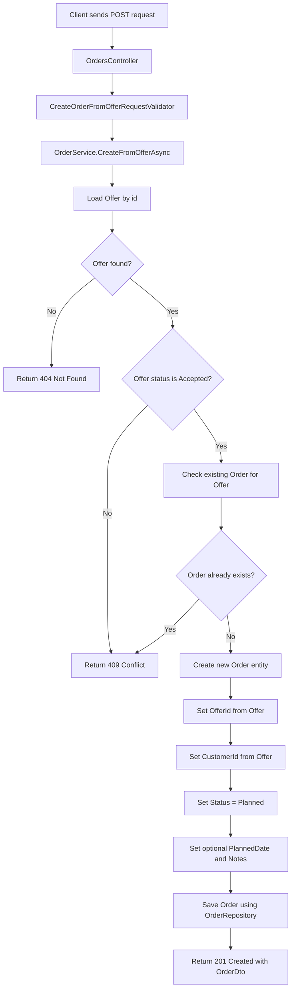

# Create Order From Offer Flow

This document describes the business and technical flow for creating a new order from an accepted offer.

The feature is exposed through the following API endpoint:

```http
POST /api/offers/{offerId}/order
```

---

## Purpose

An order represents actual work that should be planned, executed and completed.

An offer is only a proposal for a customer.

When the customer accepts the offer, the system can convert this offer into an order.

Examples:

* Lawn mowing order
* Hedge cutting order
* Green waste disposal order
* Pressure washing order

An order is always based on one accepted offer.
Each offer can only be converted into one order.

---

## Business Rule

The client is only allowed to send optional order planning information.

The backend is responsible for:

* Loading the selected offer
* Verifying that the offer exists
* Verifying that the offer status is `Accepted`
* Checking that no order already exists for this offer
* Creating the order with status `Planned`
* Copying `OfferId` and `CustomerId` from the offer
* Persisting the new order

This prevents clients from creating orders from invalid offer states or manipulating the relationship between offers, customers and orders.

---

## Request

```http
POST /api/offers/{offerId}/order
```

### Route parameter

```text
offerId
```

The id of the accepted offer that should be converted into an order.

### Request body

```json
{
  "plannedDate": "2026-08-01T09:00:00Z",
  "notes": "First order created from accepted offer."
}
```

`plannedDate` is optional, but if provided, it must be in the future.

`notes` is optional and can be used to store additional information about the order.

---

## Flow Diagram



---

## Technical Flow

### 1. Controller receives the request

The `OrdersController` receives:

* `offerId` from the URL
* `CreateOrderFromOfferRequest` from the request body

The controller does not contain business logic.
It forwards the request to the application service.

```text
OrdersController
↓
IOrderService
```

---

### 2. Request body is validated

The `CreateOrderFromOfferRequestValidator` validates the request body.

Validation rules:

* `plannedDate` must be in the future if provided
* `notes` must not exceed the configured maximum length

If validation fails, the API returns:

```http
400 Bad Request
```

This happens before the application service logic is executed.

---

### 3. Service loads the offer

The `OrderService` loads the offer by id.

```text
IOfferRepository.GetByIdAsync(offerId)
```

If the offer does not exist, the service throws a `NotFoundException`.

The global exception middleware maps this exception to:

```http
404 Not Found
```

---

### 4. Service checks the offer status

The offer must have the status `Accepted`.

```text
Offer.Status == Accepted
```

If the offer is still `Draft`, `Sent` or `Rejected`, the service throws a `ConflictException`.

The global exception middleware maps this exception to:

```http
409 Conflict
```

Reason:

```text
Only accepted offers can be converted into orders.
```

This protects the business workflow because only accepted offers should become real orders.

---

### 5. Service checks for an existing order

The service checks whether an order already exists for the selected offer.

```text
IOrderRepository.GetByOfferIdAsync(offerId)
```

If an order already exists, the service throws a `ConflictException`.

The global exception middleware maps this exception to:

```http
409 Conflict
```

Reason:

```text
An order already exists for this offer.
```

This prevents duplicate orders for the same offer.

---

### 6. Service creates the Order entity

The service creates a new `Order` entity using:

* Offer id
* Customer id
* Initial order status
* Optional planned date
* Optional notes

The new order starts with:

```text
Status = Planned
```

This entity represents the internal business state that will be persisted.

---

### 7. Service saves the order

The new order is saved through the repository.

```text
OrderService
↓
IOrderRepository
↓
OrderRepository
↓
AppDbContext
↓
PostgreSQL
```

The application layer does not know Entity Framework Core directly.
Database-specific logic remains inside the infrastructure layer.

---

## Response

If the order was created successfully, the API returns:

```http
201 Created
```

### Example response

```json
{
  "id": "00000000-0000-0000-0000-000000000000",
  "offerId": "00000000-0000-0000-0000-000000000000",
  "customerId": "00000000-0000-0000-0000-000000000000",
  "status": 1,
  "plannedDate": "2026-08-01T09:00:00Z",
  "completedAt": null,
  "notes": "First order created from accepted offer."
}
```

---

## Error Cases

### Offer not found

If the offer id does not exist:

```http
404 Not Found
```

### Offer is not accepted

If the offer status is not `Accepted`:

```http
409 Conflict
```

### Order already exists

If an order already exists for the offer:

```http
409 Conflict
```

### Invalid request body

If validation fails:

```http
400 Bad Request
```

---

## Design Decisions

### Why is `offerId` part of the URL?

The offer id identifies the source resource.

```http
POST /api/offers/{offerId}/order
```

This means:

```text
Create an order from this specific offer.
```

---

### Why does the client not send `OfferId` or `CustomerId` in the body?

The order must be based on the selected offer.

If the client could send `OfferId` or `CustomerId` directly in the body, the relationship between offer, customer and order could be manipulated.

Therefore:

```text
Client sends optional planning data.
Backend determines OfferId and CustomerId from the accepted offer.
```

---

### Why does the offer need to be accepted?

An order represents real planned work.

Only an accepted offer should become an order.

This prevents draft, sent or rejected offers from accidentally becoming active work orders.

---

### Why is duplicate order creation prevented?

Each offer should only result in one order.

Without this rule, the same accepted offer could create multiple duplicate orders.

Therefore, the system checks for an existing order before creating a new one.

---

## Related Order Management Features

The current implementation supports basic order management.

Implemented:

* Creating orders from accepted offers
* Listing all orders
* Getting orders by id
* Updating order status, planned date and notes
* Automatically setting `completedAt` when an order is completed
* Clearing `completedAt` when an order is reopened
* Soft deleting orders

Not implemented yet:

* Dedicated complete order endpoint
* Dedicated cancel order endpoint
* Order scheduling calendar
* Order assignment to users or workers
* Order PDF or report generation
