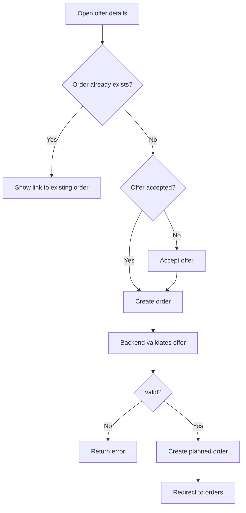

# Create Order From Offer Flow

This document describes how an accepted offer is converted into an order.

The order creation flow is a key business process because it turns a sales document into an operational service order.

---

## Purpose

An offer represents a proposal to a customer.

An order represents accepted work that should be planned, executed and completed.

```text
Offer
→ Accepted Offer
→ Order
```

The application keeps the original offer as a historical record and creates a separate order for operational handling.

---

## Business Rule

An order can only be created from an accepted offer.

This prevents draft, sent or rejected offers from accidentally becoming real work orders.

---

## Flow Overview



---

## API Endpoint

```http
POST /api/offers/{offerId}/order
```

The endpoint expects a JSON request body.

Current request body:

```json
{}
```

The request body is intentionally empty at the moment because the order is created from the accepted offer and does not yet require additional input from the frontend.

---

## Backend Responsibilities

The backend is responsible for enforcing the business rules.

| Responsibility           | Description                            |
| ------------------------ | -------------------------------------- |
| Validate offer existence | The offer must exist                   |
| Validate offer status    | The offer must be accepted             |
| Prevent duplicate orders | Only one order may exist for one offer |
| Create order             | A new order is created from the offer  |
| Set initial status       | The order starts as `Planned`          |
| Keep offer history       | The original offer remains available   |

---

## Frontend Responsibilities

The frontend improves the user experience but does not replace backend validation.

| Responsibility                | Description                                            |
| ----------------------------- | ------------------------------------------------------ |
| Provide a clear action        | The user clicks `Angebot annehmen & Auftrag erstellen` |
| Update offer status if needed | Draft or sent offers are set to accepted first         |
| Send order creation request   | Calls `POST /api/offers/{offerId}/order`               |
| Prevent duplicate UI action   | Existing orders are detected and the button is hidden  |
| Redirect after success        | The user is redirected to `/orders`                    |
| Link to existing order        | Converted offers link directly to the related order    |

---

## Current Frontend Behavior

The current frontend behavior is implemented on:

```text
/offers/:offerId
```

Possible states:

| Offer state            | Frontend behavior                               |
| ---------------------- | ----------------------------------------------- |
| Draft or Sent          | Show `Angebot annehmen & Auftrag erstellen`     |
| Accepted without order | Show `Auftrag erstellen`                        |
| Accepted with order    | Hide creation button and show link to the order |
| Rejected               | Show message that the offer cannot be converted |
| Converted              | Make offer item changes read-only               |

---

## Order Status

Newly created orders start with:

```text
Planned
```

Current order status values:

| Value | Status     | Meaning                                     |
| ----- | ---------- | ------------------------------------------- |
| 1     | Planned    | The order exists but is not yet in progress |
| 2     | InProgress | The order is currently being worked on      |
| 3     | Completed  | The order has been completed                |
| 4     | Cancelled  | The order was cancelled                     |

---

## Error Handling

Typical error cases:

| Case                    | Expected behavior                                             |
| ----------------------- | ------------------------------------------------------------- |
| Offer does not exist    | Backend returns an error                                      |
| Offer is not accepted   | Backend rejects order creation                                |
| Order already exists    | Backend prevents duplicate order creation                     |
| Missing authentication  | Request fails with unauthorized response                      |
| Missing role permission | Request fails with forbidden response                         |
| Invalid request format  | Request fails with unsupported media type or validation error |

The frontend displays a user-readable error message when the order creation request fails.

---

## Why the Order Is a Separate Entity

The application does not simply rename an accepted offer into an order.

Instead, it creates a separate order because both concepts have different responsibilities.

| Concept | Responsibility                                               |
| ------- | ------------------------------------------------------------ |
| Offer   | Sales document, pricing foundation and customer proposal     |
| Order   | Operational work item for planning, execution and completion |

This separation makes the system easier to extend later with scheduling, employee assignment, order status updates and reporting.

---

## Current Limitations

| Limitation                                                | Notes                                             |
| --------------------------------------------------------- | ------------------------------------------------- |
| Order creation request body is currently empty            | Future versions may include planned date or notes |
| Order details are read-only in the frontend               | Editing is planned for a later milestone          |
| Order planning is not implemented in the frontend yet     | Planned for `v0.14.0`                             |
| Order status updates are not editable in the frontend yet | Planned for `v0.14.0`                             |

---

## Future Improvements

Possible future improvements:

* ask for a planned date during order creation
* assign an employee to an order
* allow order status transitions in the frontend
* add dedicated complete and cancel actions
* display upcoming orders on the dashboard
* send order confirmation emails

---

## Related Documentation

* [Offer-to-Order Workflow](offer-to-order-workflow.md)
* [Add Offer Item Flow](add-offer-item-flow.md)
* [API Endpoints](../api/endpoints.md)
* [Frontend Architecture](../frontend/frontend-architecture.md)
