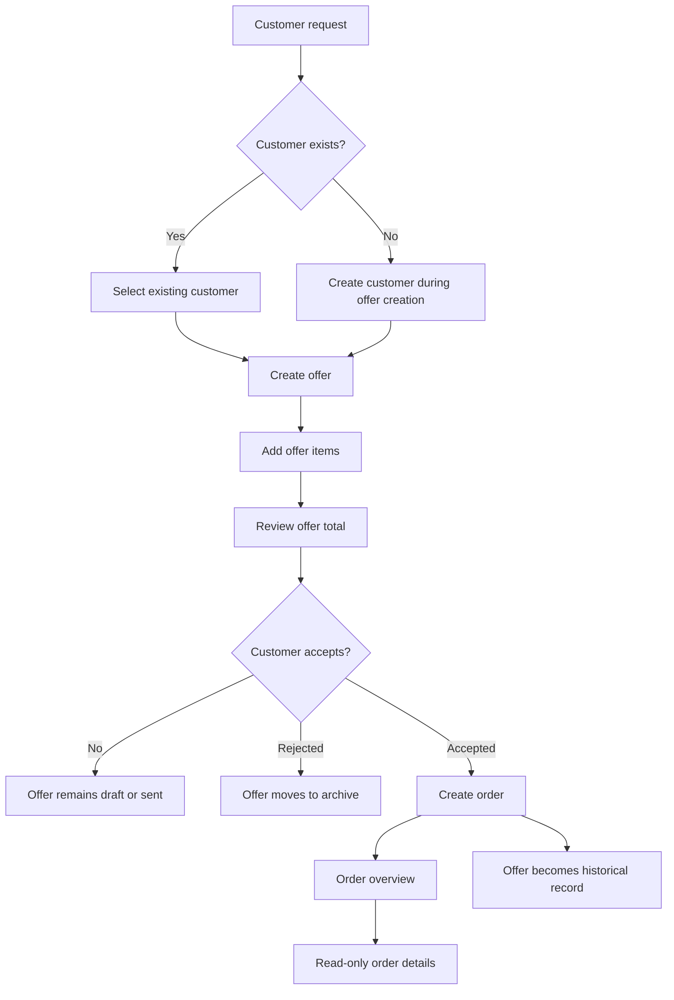
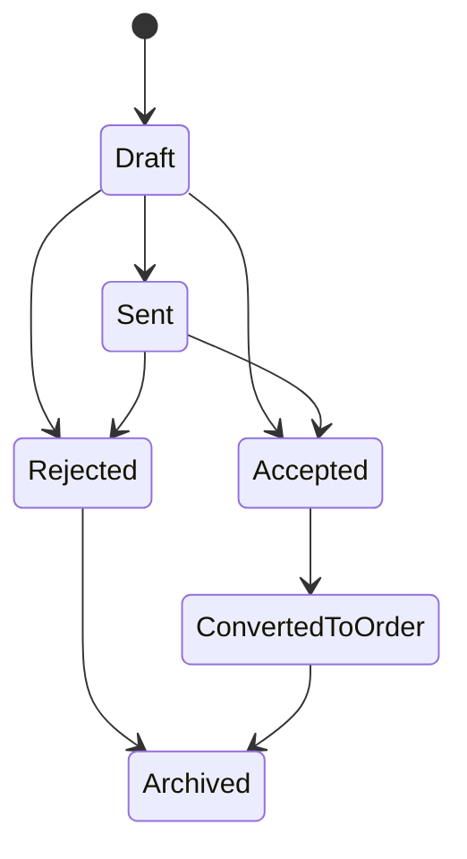
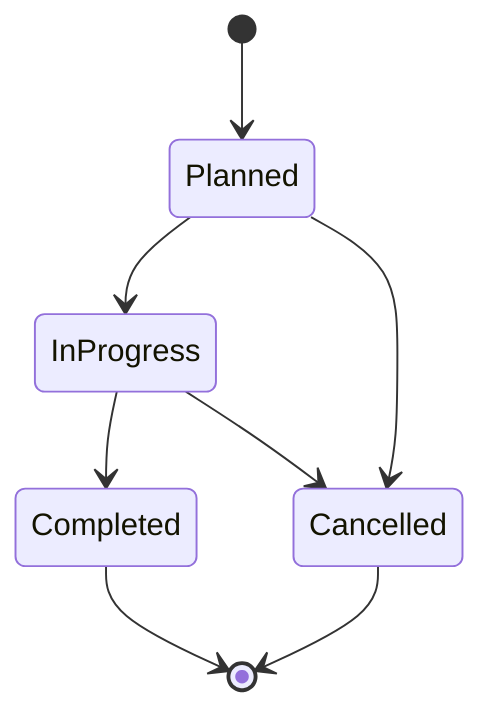

# Offer-to-Order Workflow

This document describes the end-to-end business workflow from customer data to offer creation and order conversion.

It is one of the central workflows of the Gartenzwerge Außenservice management application.

---

## Purpose

The workflow models how a real service business turns a customer request into a planned work order.

```text
Customer
→ Offer
→ Offer Items
→ Accepted Offer
→ Order
```

The goal is to separate sales work from operational work.

```text
/offers
→ active offer work and offer history

/orders
→ real service orders
```

---

## End-to-End Workflow



---

## Screen Responsibilities

| Route              | Responsibility                                                           |
| ------------------ | ------------------------------------------------------------------------ |
| `/offers`          | Show open offers by default and provide access to archived offer history |
| `/offers/new`      | Create offers for existing or newly created customers                    |
| `/offers/:offerId` | Show offer details, offer items and conversion actions                   |
| `/orders`          | Show real service orders                                                 |
| `/orders/:orderId` | Show read-only order details and the related offer foundation            |

---

## Business Concepts

| Concept        | Meaning                                              |
| -------------- | ---------------------------------------------------- |
| Customer       | Person or company receiving the service              |
| OfferedService | Reusable service with price, unit and active status  |
| Offer          | Sales document for a customer                        |
| OfferItem      | Position inside an offer                             |
| Accepted Offer | Offer confirmed by the customer                      |
| Order          | Operational work item created from an accepted offer |

---

## Offer Lifecycle



---

## Order Lifecycle



---

## Offer Overview Behavior

The offer overview is designed around active work first.

| Filter  | Shows                                                    |
| ------- | -------------------------------------------------------- |
| Open    | Draft, sent and accepted offers without an order         |
| Archive | Rejected offers and offers already converted into orders |
| All     | All offers                                               |

Converted offers are not deleted. They remain available as historical records and link to the related order.

---

## Order Overview Behavior

The orders overview shows real service orders created from accepted offers.

Because the current `OrderDto` is lightweight, the frontend combines order data with related offer data to display:

| Displayed information | Source        |
| --------------------- | ------------- |
| Order status          | Order         |
| Planned date          | Order         |
| Completed date        | Order         |
| Customer name         | Related offer |
| Offer number          | Related offer |
| Total amount          | Related offer |

This keeps the UI useful while the backend API remains simple.

---

## Read-Only Rules

To protect business history, the frontend prevents changes to offer items when an offer is no longer active offer work.

| Condition                                  | Result                                   |
| ------------------------------------------ | ---------------------------------------- |
| Offer is accepted                          | Offer becomes read-only for item changes |
| Offer is rejected                          | Offer becomes read-only for item changes |
| Order exists for offer                     | Offer becomes read-only for item changes |
| Offer is draft or sent and no order exists | Offer items can still be added           |

---

## Why Converted Offers Stay Available

Converted offers are kept because they remain the pricing and agreement foundation for the order.

They are useful for:

* checking the original customer agreement
* reviewing the price basis
* tracing how an order was created
* linking business history from order back to offer

The system therefore archives converted offers instead of deleting or hiding them completely.

---

## Current Implementation Status

| Area                                        | Status      |
| ------------------------------------------- | ----------- |
| Customer selection during offer creation    | Implemented |
| New customer creation during offer creation | Implemented |
| Offer creation                              | Implemented |
| Offer item creation                         | Implemented |
| Offer total refresh                         | Implemented |
| Offer acceptance                            | Implemented |
| Order creation from offer                   | Implemented |
| Duplicate order prevention                  | Implemented |
| Orders overview                             | Implemented |
| Read-only order details                     | Implemented |
| Offer filters                               | Implemented |
| Order planning                              | Planned     |
| Order status editing                        | Planned     |
| Dashboard upcoming orders                   | Planned     |

---

## Screenshot Plan

Screenshots should be added after the `v0.13.0` release, when the UI is stable.

Planned screenshots:

| Screenshot                             | Suggested file                                             |
| -------------------------------------- | ---------------------------------------------------------- |
| Offer overview with filters            | `docs/assets/screenshots/offers-overview-filters.png`      |
| Offer creation with customer lookup    | `docs/assets/screenshots/offer-create-customer-lookup.png` |
| Offer details with existing order link | `docs/assets/screenshots/offer-details-converted.png`      |
| Orders overview                        | `docs/assets/screenshots/orders-overview.png`              |
| Read-only order details                | `docs/assets/screenshots/order-details.png`                |

---

## Future Improvements

Possible future improvements:

* order planning directly after order creation
* planned date editing
* order status transitions in the frontend
* order notes editing
* employee assignment
* dashboard section for upcoming orders
* PDF generation for accepted offers
* email sending for offers and orders

---

## Related Documentation

* [Add Offer Item Flow](add-offer-item-flow.md)
* [Create Order From Offer Flow](create-order-from-offer-flow.md)
* [Current Project Status](../project/current-status.md)
* [Project Roadmap](../project/roadmap.md)
* [Frontend Architecture](../frontend/frontend-architecture.md)
* [API Endpoints](../api/endpoints.md)
