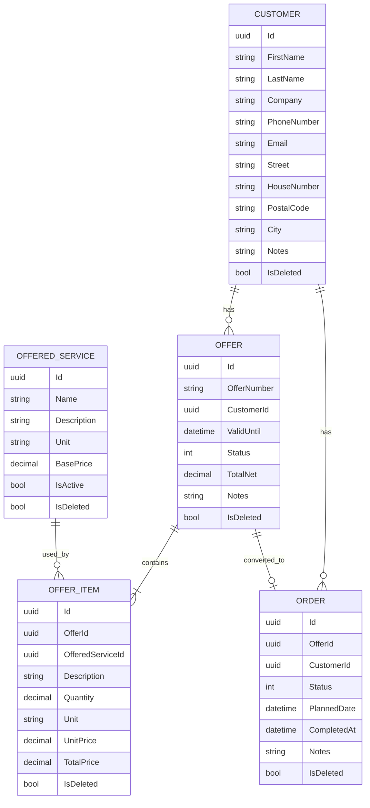
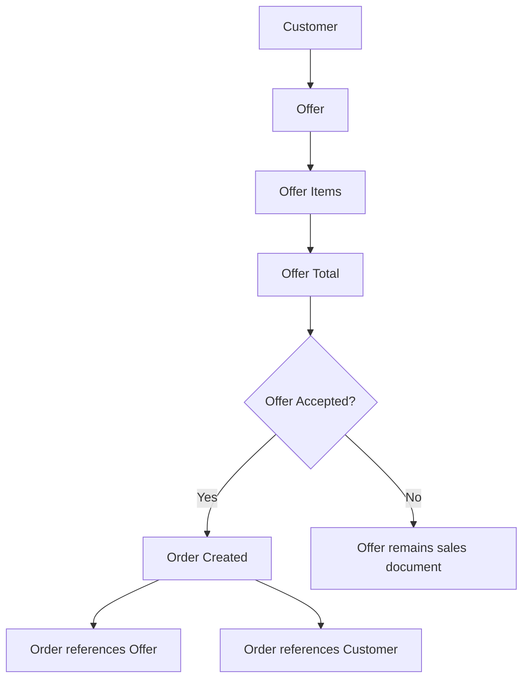

# Entity Relationships

This document describes the main domain entities and their relationships in the Gartenzwerge backend.

The domain model supports the core business workflow:

```text
Customer
→ Offer
→ Offer Items
→ Accepted Offer
→ Order
```

---

## Overview

The application currently manages the following core business entities:

* Customer
* OfferedService
* Offer
* OfferItem
* Order

All entities inherit from `BaseEntity`.

`BaseEntity` provides shared fields such as:

| Field       | Purpose                  |
| ----------- | ------------------------ |
| `Id`        | Unique entity identifier |
| `CreatedAt` | Creation timestamp       |
| `UpdatedAt` | Last update timestamp    |
| `IsDeleted` | Soft-delete flag         |
| `DeletedAt` | Soft-delete timestamp    |

Soft-deleted entities are marked with `IsDeleted = true` instead of being physically removed from the database.

---

## Entity Relationship Diagram



---

## Relationship Summary

| Relationship               | Type   | Meaning                                             |
| -------------------------- | ------ | --------------------------------------------------- |
| Customer → Offer           | 1:n    | One customer can have many offers                   |
| Customer → Order           | 1:n    | One customer can have many orders                   |
| Offer → OfferItem          | 1:n    | One offer can contain many offer items              |
| OfferedService → OfferItem | 1:n    | One offered service can be used in many offer items |
| Offer → Order              | 1:0..1 | One accepted offer can be converted into one order  |

---

# Entities

## Customer

A customer represents a person or company that can receive offers and orders.

### Relationships

```text
Customer 1 ─── n Offer
Customer 1 ─── n Order
```

A customer can have multiple offers and multiple orders.

### Important Fields

| Field         | Purpose                |
| ------------- | ---------------------- |
| `FirstName`   | Customer first name    |
| `LastName`    | Customer last name     |
| `Company`     | Optional company name  |
| `PhoneNumber` | Optional phone number  |
| `Email`       | Optional email address |
| `Street`      | Address street         |
| `HouseNumber` | Address house number   |
| `PostalCode`  | Address postal code    |
| `City`        | Address city           |
| `Notes`       | Internal notes         |

---

## OfferedService

An offered service represents a reusable service that the business can provide.

Examples:

* lawn mowing
* hedge cutting
* green waste disposal
* pressure washing

### Relationships

```text
OfferedService 1 ─── n OfferItem
```

An offered service can be used in many offer items.

The offered service provides the base price and unit. The offer item stores the selected quantity, copied unit price and calculated total price.

### Important Fields

| Field         | Purpose                                                              |
| ------------- | -------------------------------------------------------------------- |
| `Name`        | Service name                                                         |
| `Description` | Service description                                                  |
| `Unit`        | Pricing unit, for example `m²`, `m`, `hour` or `piece`               |
| `BasePrice`   | Default service price                                                |
| `IsActive`    | Controls whether the service should be available for new offer items |

---

## Offer

An offer represents a customer offer.

It is a sales document and pricing foundation for a potential customer order.

### Relationships

```text
Customer 1 ─── n Offer
Offer 1 ─── n OfferItem
Offer 1 ─── 0..1 Order
```

An offer belongs to exactly one customer.

An offer can contain multiple offer items.

An offer can optionally be converted into one order after it has been accepted.

### Important Fields

| Field         | Purpose                                              |
| ------------- | ---------------------------------------------------- |
| `OfferNumber` | Human-readable offer number generated by the backend |
| `CustomerId`  | Reference to the customer                            |
| `ValidUntil`  | Date until which the offer is valid                  |
| `Status`      | Current offer status                                 |
| `TotalNet`    | Current net total of active offer items              |
| `Notes`       | Internal or customer-related offer notes             |

### Offer Status Values

| Value | Status     | Meaning                            |
| ----- | ---------- | ---------------------------------- |
| `1`   | `Draft`    | Offer is being prepared            |
| `2`   | `Sent`     | Offer was sent to the customer     |
| `3`   | `Accepted` | Offer was accepted by the customer |
| `4`   | `Rejected` | Offer was rejected                 |

### Total Calculation

The offer total is recalculated whenever active offer items are added, updated or soft-deleted.

```text
Offer Total = Sum of active offer item totals
```

Soft-deleted offer items are excluded from the calculation.

---

## OfferItem

An offer item represents one service position inside an offer.

### Relationships

```text
Offer 1 ─── n OfferItem
OfferedService 1 ─── n OfferItem
```

An offer item belongs to exactly one offer.

An offer item references exactly one offered service.

### Important Fields

| Field              | Purpose                                   |
| ------------------ | ----------------------------------------- |
| `OfferId`          | Reference to the offer                    |
| `OfferedServiceId` | Reference to the selected offered service |
| `Description`      | Copied or generated item description      |
| `Quantity`         | Selected service quantity                 |
| `Unit`             | Unit copied from the offered service      |
| `UnitPrice`        | Price copied from the offered service     |
| `TotalPrice`       | Calculated item total                     |

### Price Calculation

```text
Total Price = Quantity × Unit Price
```

The backend calculates the item total. The frontend displays the result but is not the source of truth.

---

## Order

An order represents real work created from an accepted offer.

It is an operational entity for planning, execution and completion.

### Relationships

```text
Offer 1 ─── 0..1 Order
Customer 1 ─── n Order
```

An order belongs to exactly one offer.

An order belongs to exactly one customer.

Each offer can only be converted into one order.

### Important Fields

| Field         | Purpose                         |
| ------------- | ------------------------------- |
| `OfferId`     | Reference to the accepted offer |
| `CustomerId`  | Reference to the customer       |
| `Status`      | Current order status            |
| `PlannedDate` | Optional planned execution date |
| `CompletedAt` | Completion timestamp            |
| `Notes`       | Internal order notes            |

### Order Status Values

| Value | Status       | Meaning                                 |
| ----- | ------------ | --------------------------------------- |
| `1`   | `Planned`    | Order exists but is not yet in progress |
| `2`   | `InProgress` | Order is currently being worked on      |
| `3`   | `Completed`  | Order has been completed                |
| `4`   | `Cancelled`  | Order was cancelled                     |

### Completion Behavior

A new order starts with the status `Planned`.

When an order status is changed to `Completed`, `CompletedAt` is set automatically.

When an order is changed away from `Completed`, `CompletedAt` is cleared again.

---

# Business Rules

| Rule                                                  | Reason                                                          |
| ----------------------------------------------------- | --------------------------------------------------------------- |
| A customer can have multiple offers                   | Customers may request multiple jobs over time                   |
| A customer can have multiple orders                   | Customers may have multiple accepted jobs                       |
| An offer belongs to exactly one customer              | Offers are customer-specific                                    |
| An offer can contain multiple offer items             | Offers usually consist of several service positions             |
| An offer item references one offered service          | Pricing is based on reusable service data                       |
| Offer totals are calculated from active offer items   | Keeps pricing consistent                                        |
| An order can only be created from an accepted offer   | Prevents draft, sent or rejected offers from becoming real work |
| Each offer can only have one order                    | Prevents duplicate operational work                             |
| Orders copy `OfferId` and `CustomerId` from the offer | Maintains business traceability                                 |
| Soft-deleted records are excluded from normal queries | Keeps historical data while hiding inactive records             |

---

# Soft Delete

Soft delete means that a record is not physically removed from the database.

Instead, it is marked as deleted.

```text
IsDeleted = true
DeletedAt = timestamp
```

This is useful because business records often need to remain traceable even if they are no longer shown in normal application views.

Soft delete is used for business entities such as:

* customers
* offered services
* offers
* offer items
* orders

---

# Data Flow Example

The following example shows how the main entities work together when an order is created.



---

# Query Behavior

Normal read queries should exclude soft-deleted entities.

Examples:

| Query                | Expected behavior                 |
| -------------------- | --------------------------------- |
| Get customers        | Excludes soft-deleted customers   |
| Get offered services | Excludes soft-deleted services    |
| Get offers           | Excludes soft-deleted offers      |
| Get offer items      | Excludes soft-deleted offer items |
| Get orders           | Excludes soft-deleted orders      |

---

# Related Documentation

* [Clean Architecture](../architecture/clean-architecture.md)
* [Request Flow](../architecture/request-flow.md)
* [API Endpoints](../api/endpoints.md)
* [Offer-to-Order Workflow](../business-processes/offer-to-order-workflow.md)
* [Create Order From Offer Flow](../business-processes/create-order-from-offer-flow.md)
