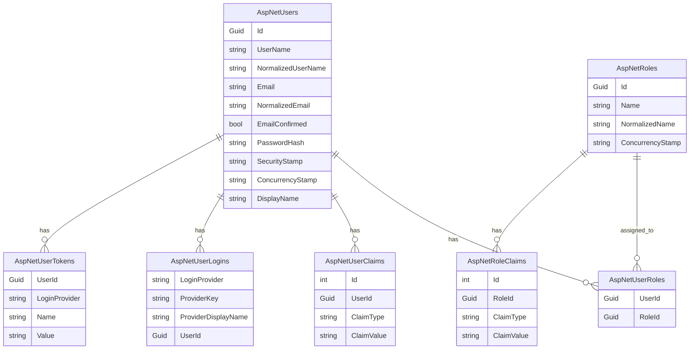

# Identity Schema

This document describes the database tables created and used by ASP.NET Core Identity.

The Identity schema belongs to the technical authentication and authorization infrastructure. It is separate from the core business domain model.

---

## Purpose

The Identity schema stores application users, roles and authentication-related data.

It supports:

* user registration
* user login
* password hashing
* role-based authorization
* JWT role claims
* local development users for testing Admin and Employee behavior

The Identity tables are separate from business entities such as:

* Customer
* OfferedService
* Offer
* OfferItem
* Order

---

## ApplicationUser

The application uses a custom Identity user class:

```text
ApplicationUser : IdentityUser<Guid>
```

`ApplicationUser` extends the default ASP.NET Core Identity user with project-specific fields.

Current custom fields:

* `DisplayName`

The technical Identity base class already provides fields such as:

* `Id`
* `UserName`
* `NormalizedUserName`
* `Email`
* `NormalizedEmail`
* `EmailConfirmed`
* `PasswordHash`
* `SecurityStamp`
* `ConcurrencyStamp`
* `PhoneNumber`
* `PhoneNumberConfirmed`
* `TwoFactorEnabled`
* `LockoutEnd`
* `LockoutEnabled`
* `AccessFailedCount`

Passwords are not stored as plain text.

ASP.NET Core Identity stores password hashes.

---

## Main Identity Tables

ASP.NET Core Identity creates several tables.

| Table              | Purpose                                  |
| ------------------ | ---------------------------------------- |
| `AspNetUsers`      | Stores application users                 |
| `AspNetRoles`      | Stores available roles                   |
| `AspNetUserRoles`  | Stores user-to-role assignments          |
| `AspNetUserClaims` | Stores claims assigned directly to users |
| `AspNetRoleClaims` | Stores claims assigned to roles          |
| `AspNetUserLogins` | Stores external login provider data      |
| `AspNetUserTokens` | Stores tokens managed by Identity        |

---

## AspNetUsers

`AspNetUsers` stores application users.

Important fields include:

| Field                | Purpose                                     |
| -------------------- | ------------------------------------------- |
| `Id`                 | Unique user identifier                      |
| `UserName`           | Identity username, currently based on email |
| `NormalizedUserName` | Normalized username for lookup              |
| `Email`              | User email                                  |
| `NormalizedEmail`    | Normalized email for lookup                 |
| `EmailConfirmed`     | Email confirmation flag                     |
| `PasswordHash`       | Hashed password                             |
| `SecurityStamp`      | Used to invalidate credentials              |
| `ConcurrencyStamp`   | Used for concurrency checks                 |
| `DisplayName`        | Project-specific display name               |

---

## AspNetRoles

`AspNetRoles` stores available roles.

Current application roles:

| Role       | Purpose                                           |
| ---------- | ------------------------------------------------- |
| `Admin`    | Full management access including critical actions |
| `Employee` | Regular business workflow access                  |

Roles are seeded during local development startup.

---

## AspNetUserRoles

`AspNetUserRoles` stores the relationship between users and roles.

```text
ApplicationUser n ─── n IdentityRole
```

This table is currently used to assign development users to Admin and Employee roles.

Current local development users:

| User                       | Role     |
| -------------------------- | -------- |
| `test@gartenzwerge.de`     | Admin    |
| `employee@gartenzwerge.de` | Employee |

Both users are intended for local authorization testing.

---

## AspNetUserClaims

`AspNetUserClaims` stores additional claims assigned directly to users.

The current implementation does not manage custom user claims through application features.

JWT tokens are generated with relevant user and role information during login.

---

## AspNetRoleClaims

`AspNetRoleClaims` stores claims assigned to roles.

The current project does not use role claims for advanced permission systems yet.

Role-based authorization is currently handled through Identity roles such as `Admin` and `Employee`.

---

## AspNetUserLogins

`AspNetUserLogins` stores external login provider information.

Examples:

* Google login
* Microsoft login
* GitHub login

The current implementation does not use external login providers yet.

---

## AspNetUserTokens

`AspNetUserTokens` stores tokens managed by ASP.NET Core Identity.

This can be useful for features such as:

* email confirmation
* password reset
* two-factor authentication

The current implementation does not use Identity token providers for these workflows yet.

---

## Simplified Identity Database Model



---

## Relationship to Business Entities

At the current stage, `ApplicationUser` is not directly connected to business entities.

There is currently no relationship such as:

```text
ApplicationUser 1 ─── n Order
ApplicationUser 1 ─── n Customer
ApplicationUser 1 ─── n Offer
```

This is intentional.

Authentication and authorization are currently used to control access to the application, not to assign business records to individual users.

Future milestones may connect users to business workflows, for example:

* assigned employee for an order
* created-by user on offers
* updated-by user on orders
* audit trail for business changes
* user management for Admin users

---

## Identity vs Business Domain

The Identity schema and the business domain model have different responsibilities.

| Area            | Responsibility                                          |
| --------------- | ------------------------------------------------------- |
| Identity schema | Users, passwords, roles, claims and authentication data |
| Business domain | Customers, services, offers, offer items and orders     |

This separation keeps authentication infrastructure independent from the business workflow.

---

## Role-Based Authorization

The application uses ASP.NET Core Identity roles for backend authorization.

Current roles:

```text
Admin
Employee
```

Example backend authorization attribute:

```csharp
[Authorize(Roles = ApplicationRoles.Admin)]
```

Another common authorization rule:

```csharp
[Authorize(Roles = ApplicationRoles.AdminOrEmployee)]
```

The role names are centralized in the Application layer through `ApplicationRoles`.

The actual role storage and user-role assignments are handled by ASP.NET Core Identity tables.

---

## JWT Role Claims

When a user logs in, the backend generates a JWT token.

The token includes role claims so ASP.NET Core can evaluate role-based authorization rules on protected endpoints.

Simplified flow:

```text
Login
→ Identity validates email and password
→ User roles are loaded
→ JWT token is generated with role claims
→ Frontend uses token for authenticated API requests
→ Backend checks role claims on protected endpoints
```

---

## Local Development Seeding

For local development, the application seeds roles and development users.

Seeded roles:

* `Admin`
* `Employee`

Seeded users:

| Email                      | Role     | Purpose                |
| -------------------------- | -------- | ---------------------- |
| `test@gartenzwerge.de`     | Admin    | Test full access       |
| `employee@gartenzwerge.de` | Employee | Test restricted access |

This makes it possible to test `401 Unauthorized` and `403 Forbidden` behavior locally.

---

## Current Implementation Status

| Feature                                                 | Status          |
| ------------------------------------------------------- | --------------- |
| ASP.NET Core Identity database schema                   | Implemented     |
| Custom `ApplicationUser`                                | Implemented     |
| GUID-based Identity keys                                | Implemented     |
| Password hashing through ASP.NET Core Identity          | Implemented     |
| User registration                                       | Implemented     |
| User login                                              | Implemented     |
| JWT token generation                                    | Implemented     |
| JWT bearer authentication                               | Implemented     |
| Admin and Employee roles                                | Implemented     |
| Role seeding                                            | Implemented     |
| Development user seeding                                | Implemented     |
| User-role assignment for development users              | Implemented     |
| Role claims in JWT tokens                               | Implemented     |
| Role-based backend authorization                        | Implemented     |
| Direct relationship between users and business entities | Not implemented |
| Refresh tokens                                          | Not implemented |
| Password reset flow                                     | Not implemented |
| Email confirmation flow                                 | Not implemented |
| External login providers                                | Not implemented |
| User management endpoints                               | Not implemented |

---

## Design Decision

The project uses ASP.NET Core Identity instead of a completely custom user table.

Reasons:

* password hashing is handled by a proven framework
* user and role management can be extended later
* roles and claims are supported out of the box
* security-related defaults are provided by ASP.NET Core Identity
* the project stays close to real-world ASP.NET Core applications

---

## Important Note

The Identity schema belongs to the technical authentication infrastructure.

It should not be confused with the business domain model.

Business entities describe landscaping workflows.

Identity entities describe users, authentication and authorization.

---

## Related Documentation

* [Authentication Architecture](../architecture/authentication.md)
* [Clean Architecture](../architecture/clean-architecture.md)
* [API Endpoints](../api/endpoints.md)
* [Entity Relationships](entity-relationships.md)
