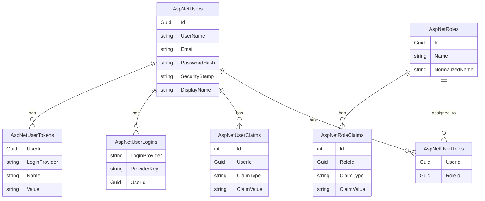

# Identity Schema

This document describes the database tables created and used by ASP.NET Core Identity.

---

## Purpose

The Identity schema stores application users and authentication-related data.

It is part of the authentication infrastructure and is managed by ASP.NET Core Identity.

The Identity tables are separate from the core business entities such as:

* Customer
* OfferedService
* Offer
* OfferItem
* Order

---

## ApplicationUser

The application uses a custom Identity user class:

```text
ApplicationUser : IdentityUser<Guid>
```

`ApplicationUser` extends the default ASP.NET Core Identity user with project-specific fields.

Current custom fields:

* `DisplayName`

The technical Identity base class already provides fields such as:

* `Id`
* `UserName`
* `NormalizedUserName`
* `Email`
* `NormalizedEmail`
* `EmailConfirmed`
* `PasswordHash`
* `SecurityStamp`
* `ConcurrencyStamp`
* `PhoneNumber`
* `PhoneNumberConfirmed`
* `TwoFactorEnabled`
* `LockoutEnd`
* `LockoutEnabled`
* `AccessFailedCount`

---

## Main Identity Tables

ASP.NET Core Identity creates several tables.

### AspNetUsers

Stores application users.

Important fields include:

* `Id`
* `UserName`
* `Email`
* `PasswordHash`
* `SecurityStamp`
* `DisplayName`

Passwords are not stored as plain text.

ASP.NET Core Identity stores password hashes.

---

### AspNetRoles

Stores available roles.

Examples for future use:

* Admin
* Employee

The current authentication foundation prepares roles technically, but role-based authorization is not implemented yet.

---

### AspNetUserRoles

Stores the relationship between users and roles.

```text
ApplicationUser n ─── n IdentityRole
```

This table will become relevant when role-based authorization is implemented.

---

### AspNetUserClaims

Stores additional claims assigned directly to users.

Claims can describe additional user information or permissions.

The current implementation does not manage custom user claims yet.

---

### AspNetRoleClaims

Stores claims assigned to roles.

This can be useful later for more advanced permission systems.

The current implementation does not manage role claims yet.

---

### AspNetUserLogins

Stores external login provider information.

Examples:

* Google login
* Microsoft login
* GitHub login

The current implementation does not use external login providers yet.

---

### AspNetUserTokens

Stores tokens managed by ASP.NET Core Identity.

This can be useful for features such as:

* Email confirmation
* Password reset
* Two-factor authentication

The current implementation does not use Identity token providers yet.

---

## Simplified Identity Database Model



## Relationship to Business Entities

At the current stage, `ApplicationUser` is not directly connected to business entities.

There is currently no relationship such as:

```text
ApplicationUser 1 ─── n Order
ApplicationUser 1 ─── n Customer
```

This is intentional.

The current authentication milestone focuses on proving that users can register, log in and access protected endpoints.

Future milestones may connect users to business workflows, for example:

* Assigned employee for an order
* CreatedBy user on offers
* UpdatedBy user on orders
* Admin-only management endpoints

---

## Current Implementation

Implemented:

* ASP.NET Core Identity database schema
* Custom `ApplicationUser`
* GUID-based Identity keys
* Password hashing through ASP.NET Core Identity
* User registration
* User login
* JWT token generation
* JWT bearer authentication

Not implemented yet:

* Role-based authorization
* User-role assignment
* Admin or Employee role workflows
* Refresh tokens
* Password reset
* Email confirmation
* External login providers
* Direct relationship between users and business entities

---

## Design Decision

The project uses ASP.NET Core Identity instead of a completely custom user table.

Reason:

* Password hashing is handled by a proven framework
* User management is easier to extend later
* Roles and claims are technically prepared
* Security-related defaults are provided by ASP.NET Core Identity
* The project stays closer to real-world ASP.NET Core applications

---

## Important Note

The Identity schema belongs to the technical authentication infrastructure.

It should not be confused with the business domain model.

Business entities describe landscaping workflows.

Identity entities describe users, authentication and future authorization.
