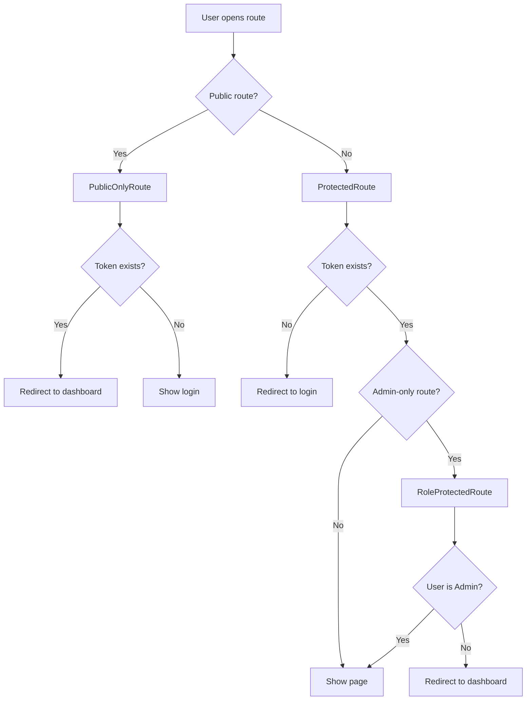
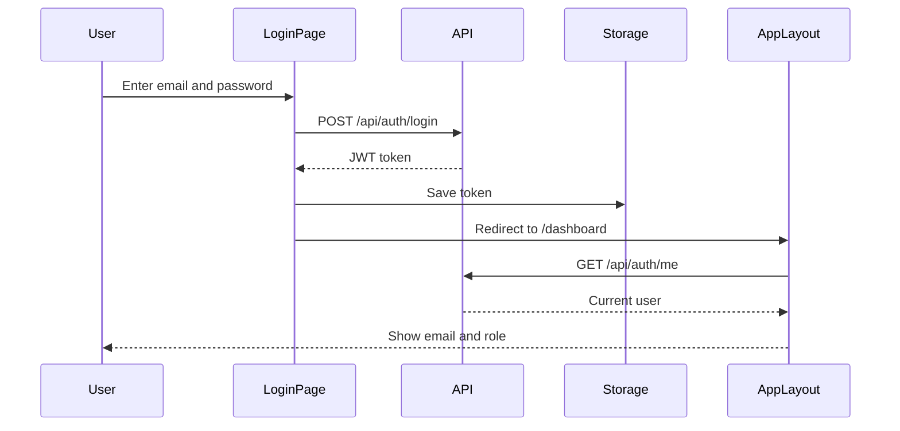
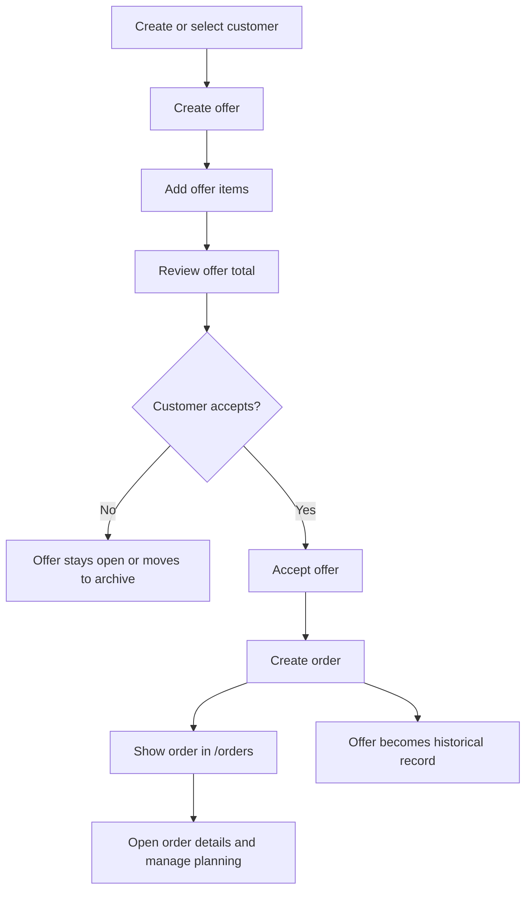

# Frontend Architecture

This document explains the current frontend architecture of the Gartenzwerge management application.

The frontend is a React client for the ASP.NET Core backend API. It provides a mobile-first business interface with authentication, protected routes, role-aware navigation and connected workflows for customers, offers and orders.

---

## Goal

The frontend is designed to support a realistic service business workflow:

```text
Customer
→ Offer
→ Offer Items
→ Accepted Offer
→ Order
```

The current frontend separates offer work from operational order work:

```text
/offers
→ active offer work and offer history

/orders
→ real service orders
```

Frontend route protection improves the user experience, but the backend remains the real security boundary. Authorization and business rules must always be enforced by the API.

---

## Technologies

| Technology   | Usage                                |
| ------------ | ------------------------------------ |
| React        | UI library                           |
| TypeScript   | Type-safe frontend development       |
| Vite         | Development server and build tooling |
| React Router | Frontend routing                     |
| CSS          | Mobile-first responsive styling      |
| localStorage | Current development JWT storage      |

---

## Project Structure

```text
src/
├── api/
├── app/
├── auth/
├── pages/
├── shared/
└── styles/
    ├── components/
    └── pages/
```

---

## Folder Responsibilities

| Folder   | Responsibility                                   |
| -------- | ------------------------------------------------ |
| `api`    | Frontend API functions for backend communication |
| `app`    | App-wide layout and structure                    |
| `auth`   | Token storage and route guards                   |
| `pages`  | Route-level page components                      |
| `shared` | Reusable UI components                           |
| `styles` | Structured global CSS files                      |

---

## API Modules

The frontend keeps backend communication in dedicated API modules.

| Module               | Responsibility                                        |
| -------------------- | ----------------------------------------------------- |
| `authApi`            | Login and current user loading                        |
| `customersApi`       | Customer read, create, update and delete              |
| `offeredServicesApi` | Offered service read and create                       |
| `offersApi`          | Offer overview, detail, create and update             |
| `offerItemsApi`      | Offer item read and create                            |
| `ordersApi`          | Order overview, detail, update and order creation from offers |

This keeps API logic separate from page components.

---

## Authentication Helpers

The `auth` folder contains frontend authentication helpers and route guard components.

| File / Component     | Responsibility                                  |
| -------------------- | ----------------------------------------------- |
| `authStorage`        | Store, read and remove the JWT token            |
| `ProtectedRoute`     | Protect authenticated app routes                |
| `PublicOnlyRoute`    | Redirect authenticated users away from `/login` |
| `RoleProtectedRoute` | Protect Admin-only frontend routes              |

---

## Routing

Current frontend routes:

| Route               | Purpose                              | Protection    |
| ------------------- | ------------------------------------ | ------------- |
| `/login`            | Login page                           | Public-only   |
| `/dashboard`        | Operational entry page               | Authenticated |
| `/customers`        | Customer management                  | Authenticated |
| `/offers`           | Offer overview with filters          | Authenticated |
| `/offers/new`       | Create a new offer                   | Authenticated |
| `/offers/:offerId`  | Offer details and conversion actions | Authenticated |
| `/orders`           | Orders overview with filters         | Authenticated |
| `/orders/:orderId`  | Order details and planning           | Authenticated |
| `/more`             | Secondary navigation                 | Authenticated |
| `/analytics`        | Future reporting area                | Admin-only    |
| `/offered-services` | Offered service management           | Admin-only    |

---

## Route Protection



The frontend route guards improve navigation and user experience. The backend still enforces real authentication and authorization.

---

## Authentication Flow



The current user is loaded through:

```http
GET /api/auth/me
```

Example response:

```json
{
  "userId": "019eca0b-1a65-70bc-9821-1f6a0c344c11",
  "email": "test@gartenzwerge.de",
  "displayName": "Test User",
  "roles": ["Admin"]
}
```

---

## Logout Flow

```text
Logout button
→ remove token from localStorage
→ redirect to /login
```

---

## Role-Based Frontend Behavior

| Role     | Allowed frontend areas                                                  |
| -------- | ----------------------------------------------------------------------- |
| Admin    | Dashboard, Customers, Offers, Orders, More, Analytics, Offered Services |
| Employee | Dashboard, Customers, Offers, Orders, More                              |

Admin-only frontend areas:

```text
/analytics
/offered-services
```

If an Employee opens an Admin-only route directly, the frontend redirects to `/dashboard`.

---

## Main Business Workflow



---

## Offer Workflow

The offer workflow is split across multiple pages.

### `/offers`

Responsibilities:

* load offers from the backend
* load orders to detect converted offers
* show open offers by default
* provide filters for open, archived and all offers
* show converted offers in the archive
* link converted offers to the related order
* navigate to offer creation
* navigate to offer details

Offer filters:

| Filter  | Shows                                                    |
| ------- | -------------------------------------------------------- |
| Open    | Draft, sent and accepted offers without an order         |
| Archive | Rejected offers and offers already converted into orders |
| All     | All offers                                               |

### `/offers/new`

Responsibilities:

* load existing customers
* search customers while typing
* show matching customer suggestions
* allow selecting an existing customer
* automatically show new customer fields if no matching customer exists
* create a customer first if needed
* create the offer afterwards using the resolved customer id
* redirect back to `/offers` after successful creation

The user never needs to know or enter a technical `customerId`. The UI shows customer names and customer details, while the frontend internally uses the selected or newly created customer id for the backend request.

### `/offers/:offerId`

Responsibilities:

* load offer details
* load offer items
* load active offered services
* load orders to detect whether the offer was already converted
* display offer summary
* display existing offer items
* add new offer items while the offer is still editable
* accept the offer and create an order
* prevent duplicate order creation
* show a direct link to the created order
* make accepted, rejected and converted offers read-only for item changes

---

## Order Workflow

The order workflow starts after an offer has been accepted.

### `/orders`

Responsibilities:

* load real orders from the backend
* load offers to enrich the order overview
* show customer name, offer number and total amount from the related offer
* show order status, planned date and completed date
* filter orders by active, completed and all
* show a colored status badge per order
* navigate to order details and planning
* navigate back to the related offer

Because the current `OrderDto` is lightweight, the frontend combines order data with related offer data for a more useful overview.

| Displayed information | Source        |
| --------------------- | ------------- |
| Order status          | Order         |
| Planned date          | Order         |
| Completed date        | Order         |
| Customer name         | Related offer |
| Offer number          | Related offer |
| Total amount          | Related offer |

Order filters:

| Filter       | Shows                                   |
| ------------ | --------------------------------------- |
| Active       | Planned and in-progress orders          |
| Completed    | Completed and cancelled orders          |
| All          | All orders                              |

### `/orders/:orderId`

Responsibilities:

* load a single order
* load the related offer
* load the related offer items
* edit the order status, planned date and notes
* save changes through `PUT /api/orders/{id}`
* reload the order from the backend after saving
* display the read-only completed date when the order is completed
* display the offer foundation
* display positions from the original offer
* link back to `/orders`
* link to the related offer

The order details page lets employees manage operational order data while the backend stays the source of truth. The `completedAt` timestamp is not edited directly: the backend sets it automatically when an order becomes completed and clears it when the status changes back.

---

## Read-Only Rules

The frontend prevents offer item changes when an offer should no longer be edited.

| Condition            | Frontend behavior                              |
| -------------------- | ---------------------------------------------- |
| Offer is Draft       | Offer items can be added                       |
| Offer is Sent        | Offer items can be added                       |
| Offer is Accepted    | Offer becomes read-only                        |
| Offer is Rejected    | Offer becomes read-only                        |
| Related order exists | Offer becomes read-only and links to the order |

This protects the offer as a historical business document after order conversion.

---

## UI/UX Decisions

### Mobile-first navigation

The primary mobile navigation focuses on the most important work areas:

```text
Dashboard
Customers
Offers
Orders
More
```

Secondary and Admin-specific areas such as Analytics and Offered Services are accessible through the More page for Admin users.

### Dashboard vs Analytics

The dashboard is intended as an operational entry point.

It should later focus on:

* upcoming work
* important daily overview
* quick access to core workflows
* next recommended action

Analytics is intended for reporting and business insights.

It can later include:

* customer statistics
* completed order statistics
* revenue overview
* revenue charts
* offer-to-order conversion insights
* top services

Analytics is currently treated as an Admin-only area.

### Offers vs Orders

The frontend intentionally separates offers and orders.

```text
/offers
→ offer work and offer history

/orders
→ operational work orders
```

Converted offers are not deleted. They remain available as historical records and link to the related order.

---

## Style Architecture

The frontend uses structured CSS files instead of one large stylesheet.

```text
src/Frontend/src/
├── App.css
└── styles/
    ├── tokens.css
    ├── base.css
    ├── layout.css
    ├── components/
    │   ├── buttons.css
    │   └── forms.css
    └── pages/
        ├── auth.css
        ├── dashboard.css
        ├── more.css
        ├── customers.css
        ├── offered-services.css
        ├── offers.css
        └── orders.css
```

| File                     | Responsibility                                  |
| ------------------------ | ----------------------------------------------- |
| `tokens.css`             | Design tokens such as colors, radii and shadows |
| `base.css`               | Base element styles                             |
| `layout.css`             | App layout and navigation                       |
| `components/buttons.css` | Shared button and link-button styles            |
| `components/forms.css`   | Shared form styles                              |
| `pages/*.css`            | Page-specific styles                            |

`App.css` imports the structured CSS files.

---

## Current Frontend Status

| Area                                  | Status      |
| ------------------------------------- | ----------- |
| React + TypeScript + Vite setup       | Implemented |
| React Router foundation               | Implemented |
| Mobile-first navigation               | Implemented |
| Authentication UI                     | Implemented |
| Protected routes                      | Implemented |
| Role-aware navigation                 | Implemented |
| Customer management UI                | Implemented |
| Offered service creation UI           | Implemented |
| Offer creation workflow               | Implemented |
| Offer item creation                   | Implemented |
| Offer acceptance and order conversion | Implemented |
| Duplicate order creation prevention   | Implemented |
| Orders overview                       | Implemented |
| Order overview filters                | Implemented |
| Order details and planning            | Implemented |
| Order status, planning and notes editing | Implemented |
| Offer overview filters                | Implemented |
| Dashboard                             | Placeholder |
| Analytics                             | Placeholder |

---

## Current Limitations

| Limitation                                                         | Notes                                                                  |
| ------------------------------------------------------------------ | ---------------------------------------------------------------------- |
| No global AuthContext yet                                          | Auth state is currently handled through token storage and route guards |
| No refresh token handling yet                                      | Token expiration is not handled automatically in the frontend          |
| No full API client abstraction yet                                 | API calls are grouped by feature modules                               |
| No real dashboard data yet                                         | Dashboard is still mostly placeholder-based                            |
| No real analytics data yet                                         | Analytics is prepared but not connected to business data               |
| Offered services currently support read and create in the frontend | Edit and delete UI can be added later                                  |
| Customer lookup is client-side                                     | Acceptable for current project size                                    |
| Customers page can be refined                                      | It may later become a clearer master data area                         |
| OrderDto is lightweight                                            | Some displayed order data is combined from related offer data          |

---

## Screenshot Plan

Screenshots should be added after the `v0.13.0` release, when the UI is stable.

Planned screenshots:

| Screenshot                             | Suggested file                                             |
| -------------------------------------- | ---------------------------------------------------------- |
| Offer overview with filters            | `docs/assets/screenshots/offers-overview-filters.png`      |
| Offer creation with customer lookup    | `docs/assets/screenshots/offer-create-customer-lookup.png` |
| Offer details with existing order link | `docs/assets/screenshots/offer-details-converted.png`      |
| Orders overview with filters           | `docs/assets/screenshots/orders-overview.png`              |
| Order details with planning form       | `docs/assets/screenshots/order-details.png`                |

---

## Future Improvements

Planned frontend improvements:

* global auth state handling
* token expiration handling
* cleaner shared authorization helpers
* optional dedicated access denied page
* backend-supported customer search endpoint if customer volume grows
* improve Customers page into a clearer master data management area
* Offered Service edit and delete UI
* dashboard with upcoming orders
* calendar field for upcoming orders
* analytics with real business data
* API client abstraction for business endpoints
* PWA support

---

## Related Documentation

* [Current Project Status](../project/current-status.md)
* [Project Roadmap](../project/roadmap.md)
* [Offer-to-Order Workflow](../business-processes/offer-to-order-workflow.md)
* [Create Order From Offer Flow](../business-processes/create-order-from-offer-flow.md)
* [Add Offer Item Flow](../business-processes/add-offer-item-flow.md)
* [API Endpoints](../api/endpoints.md)
