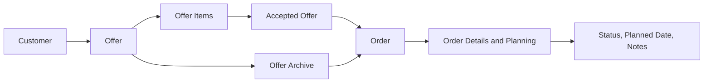

# Current Project Status

## Overview

Gartenzwerge Außenservice is currently in active development as a full-stack business management application for a landscaping and outdoor service business.

The application already supports the core workflow from customer management to offer creation and order conversion.

```text
Customer
→ Offer
→ Offer Items
→ Accepted Offer
→ Order
```

The project is developed in small, versioned milestones with a focus on realistic business workflows, clean architecture, role-based authorization and a mobile-first React frontend.

---

## Current Milestone

```text
v0.15.0 – Dashboard and Reporting UI
```

The current milestone turns the dashboard into a real operational overview and adds a reporting layer. The dashboard shows live counts for customers, open offers and upcoming orders plus the next planned orders. The analytics page reports order volume, completed volume, an offer-to-order conversion rate, the average order value, the open-offer pipeline and a 12-month revenue trend with a trend line.

## Current Business Workflow



## Capability Overview

| Area | Backend | Frontend | Status |
|---|---:|---:|---|
| Customer Management | ✅ | ✅ | Usable |
| Offered Services | ✅ | 🟡 Read/Create | Partly usable |
| Offer Creation | ✅ | ✅ | Usable |
| Offer Items | ✅ | ✅ Create/View | Usable |
| Offer Acceptance | ✅ | ✅ | Usable |
| Order Creation | ✅ | ✅ | Usable |
| Orders Overview | ✅ | ✅ | Usable |
| Order Details | ✅ | ✅ Editable | Usable |
| Order Planning & Status | ✅ | ✅ | Usable |
| Dashboard | ✅ | ✅ Live counts + upcoming orders | Usable |
| Analytics / Reporting | ✅ | ✅ Revenue, conversion, 12-month trend | Usable |

---

## Current Application Capabilities

### Backend

The backend currently provides:

* Customer management
* Offered service management
* Offer management
* Offer item management
* Order management foundation
* Authentication with ASP.NET Core Identity
* JWT-based authentication
* Role-based authorization
* Admin and Employee roles
* PostgreSQL persistence with Entity Framework Core
* Request validation with FluentValidation
* Global exception handling
* Serilog logging
* Swagger/OpenAPI documentation
* Unit tests for core business logic

### Frontend

The frontend currently provides:

* Login UI connected to the backend authentication API
* JWT token storage
* Protected frontend routes
* Role-aware navigation
* Admin-only frontend areas
* Customer management UI
* Offered service creation UI
* Offer overview
* Offer creation workflow
* Customer lookup during offer creation
* New customer creation inside the offer workflow
* Offer details view
* Offer item creation
* Offer acceptance and order conversion
* Orders overview with real backend data
* Order filters for active, completed and all orders
* Colored order status badges
* Editable order detail view for status, planned date and notes
* Automatic completed date handling through the backend
* Offer filters for open offers, archived offers and all offers
* Dashboard with live counts for customers, open offers and upcoming orders
* Dashboard list of the next planned orders sorted by planned date
* Animated dashboard statistics
* Analytics page with order volume, completed volume, conversion rate, average order value and open-offer pipeline
* 12-month revenue trend chart with a trend line (DIY SVG, no charting library)
* Structured mobile-first CSS architecture

---

## Offer and Order Workflow

The current frontend workflow separates offer work from order work:

```text
/offers
→ active offer work and offer history

/orders
→ real service orders
```

Open offers are shown by default under `/offers`.

Converted or rejected offers are available through the archive filter. Converted offers remain available as historical records and link to the related order.

Orders are shown under `/orders` and can be opened through an editable order detail page for status, planned date and notes.

---

## Current Frontend Routes

```text
/login
/dashboard
/customers
/offers
/offers/new
/offers/:offerId
/orders
/orders/:orderId
/more
/analytics
/offered-services
```

---

## Current Limitations

The project is not yet a finished business application. The following limitations are known:

* No global `AuthContext` yet
* No refresh token flow yet
* No invoicing or payments yet, so receivables metrics (outstanding, DSO, aging) are not available
* No cost tracking yet, so profit and margin are not reported
* A calendar view for upcoming orders is not built yet
* Offered services currently support read and create in the frontend
* Customer lookup during offer creation is currently performed client-side after loading all customers
* The Customers page still contains a visible creation form and may later be refined into a clearer master data area
* `OrderDto` is currently lightweight, so some order overview data is combined from `OrderDto` and related `OfferDto` data in the frontend

---

## Next Planned Step

The next logical milestone is:

```text
v0.16.0 – Fullstack Business Workflow MVP
```

Planned focus:

* polish the end-to-end customer-to-offer-to-order workflow
* improve UI consistency across pages
* local full-stack setup documentation
* a final MVP documentation pass

---

## Development Approach

The project follows a small-step development workflow:

* one focused feature per commit
* Conventional Commits
* feature branches through `develop`
* pull requests into `main`
* frontend build and lint checks before committing
* backend tests when backend logic changes
* manual browser testing for frontend workflows

This keeps the project understandable, testable and portfolio-ready.
