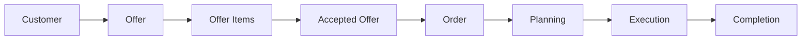

# Project Roadmap

This roadmap documents the completed and planned development milestones for the Gartenzwerge Außenservice management application.

The project is developed in small, focused milestones. Each milestone adds one meaningful part of the full business workflow instead of implementing unrelated features at once.

---

## Roadmap Overview

| Version | Milestone                                   | Status      | Focus                            |
| ------- | ------------------------------------------- | ----------- | -------------------------------- |
| v0.1.0  | Customer Management Foundation              | Completed   | Customer CRUD backend            |
| v0.2.0  | Service Management                          | Completed   | Offered services and pricing     |
| v0.3.0  | Offer Management                            | Completed   | Offers, status and offer numbers |
| v0.4.0  | Offer Item Management                       | Completed   | Offer positions and totals       |
| v0.5.0  | Request Validation                          | Completed   | Business validation rules        |
| v0.6.0  | Order Management Foundation                 | Completed   | Backend order conversion         |
| v0.7.0  | Authentication Foundation                   | Completed   | Identity and JWT                 |
| v0.8.0  | Authorization and User Roles                | Completed   | Admin and Employee roles         |
| v0.9.0  | Frontend Foundation                         | Completed   | React app foundation             |
| v0.10.0 | Authentication UI and Protected Frontend    | Completed   | Login and protected routes       |
| v0.11.0 | Customer Management and Service Creation UI | Completed   | First connected business pages   |
| v0.12.0 | Offer Creation Workflow UI                  | Completed   | Offer creation and offer items   |
| v0.13.0 | Offer Acceptance and Order Conversion UI    | In progress | Offer-to-order workflow          |
| v0.14.0 | Order Planning and Status Management UI     | Planned     | Operational order handling       |
| v0.15.0 | Dashboard and Reporting UI                  | Planned     | Business overview                |
| v0.16.0 | Fullstack Business Workflow MVP             | Planned     | Portfolio-ready MVP              |
| v0.17.0 | CI Pipeline                                 | Planned     | Automated quality checks         |
| v1.0.0  | Full Business Workflow MVP                  | Planned     | Stable release                   |

---

## Workflow Direction

The roadmap is built around the core business process of the application:



---

## Completed Milestones

### v0.1.0 – Customer Management Foundation

Goal: Build the first core business entity and establish the backend structure.

Scope:

* Customer entity
* Customer CRUD API
* Validation
* Error handling
* Logging
* Unit tests

---

### v0.2.0 – Service Management

Goal: Add reusable offered services for pricing and future offer items.

Scope:

* Offered service entity
* Offered service CRUD API
* Prices and units
* Validation
* Unit tests

---

### v0.3.0 – Offer Management

Goal: Introduce offers as the central sales document for customers.

Scope:

* Offer entity
* Offer CRUD API
* Offer status
* Automatic offer number generation
* Unit tests

---

### v0.4.0 – Offer Item Management

Goal: Add line items to offers and calculate offer totals.

Scope:

* Offer item entity
* Add offer items to existing offers
* Connect offer items to offered services
* Calculate item totals
* Recalculate offer totals
* Unit tests

---

### v0.5.0 – Request Validation

Goal: Improve request safety and prepare business rule validation.

Scope:

* FluentValidation integration
* Validation for important request models
* Better API error behavior
* Business rule preparation for pricing-related workflows

---

### v0.6.0 – Order Management Foundation

Goal: Convert accepted offers into orders on the backend.

Scope:

* Order entity
* Create orders from accepted offers
* Prevent duplicate orders
* Order validation
* View and update orders
* Unit tests

---

### v0.7.0 – Authentication and Protected API Foundation

Goal: Add authentication and protect business endpoints.

Scope:

* User registration with ASP.NET Core Identity
* User login
* Secure password hashing
* JWT token generation
* JWT bearer authentication
* Protected `/api/auth/me` endpoint
* Swagger JWT support
* Protected business endpoints

---

### v0.8.0 – Authorization and User Roles

Goal: Add user roles and role-based endpoint protection.

Scope:

* Admin and Employee roles
* Role seeding for local development
* Role claims in JWT tokens
* Role-based endpoint protection
* Admin-only protection for critical actions

---

### v0.9.0 – Frontend Foundation

Goal: Create the React frontend foundation.

Scope:

* React + TypeScript + Vite setup
* React Router
* Basic app layout
* Mobile-first navigation
* Placeholder pages for core business areas
* More page
* Analytics placeholder
* Reusable UI components
* Dashboard foundation

---

### v0.10.0 – Authentication UI and Protected Frontend

Goal: Connect frontend authentication to the backend.

Scope:

* Login form
* JWT token handling
* Redirect after successful login
* Logout
* Protected frontend routes
* Public-only login route
* Load current user through `/api/auth/me`
* Display current user email and role
* Admin-only frontend routes

---

### v0.11.0 – Customer Management and Service Creation UI

Goal: Connect the first business management screens to the backend.

Scope:

* Customer management UI
* Customer list
* Customer creation
* Customer editing
* Admin-only customer delete
* Offered service list
* Admin-only offered service creation
* Loading, error and empty states

---

### v0.12.0 – Offer Creation Workflow UI

Goal: Build the first realistic offer creation workflow in the frontend.

Scope:

* Offer overview
* Offer creation page
* Customer lookup during offer creation
* Create new customers during offer creation
* Offer detail view
* Offer item creation
* Offer total display
* Structured frontend styles

---

## Current Milestone

### v0.13.0 – Offer Acceptance and Order Conversion UI

Goal: Turn accepted offers into operational orders and separate offer work from order work.

Scope:

* Accept offers and create orders
* Prevent duplicate order creation
* Make converted offers read-only
* Orders overview
* Read-only order detail view
* Offer overview filters for open offers, archive and all offers
* Clear separation between `/offers` and `/orders`

Current status:

```text
Implementation completed on develop.
Documentation and release preparation in progress.
```

---

## Planned Milestones

### v0.14.0 – Order Planning and Status Management UI

Goal: Make orders operationally useful after creation.

Planned scope:

* Edit order planned date
* Update order status
* Add and update order notes
* Show order lifecycle more clearly
* Prepare upcoming orders for the dashboard

---

### v0.15.0 – Dashboard and Reporting UI

Goal: Turn the dashboard into a useful business overview.

Planned scope:

* Dashboard with upcoming orders
* Simple calendar field for upcoming orders
* Customer statistics
* Completed order statistics
* Revenue overview
* Offer-to-order conversion insights

---

### v0.16.0 – Fullstack Business Workflow MVP

Goal: Polish the core workflow into a portfolio-ready MVP.

Planned scope:

* End-to-end customer-to-offer-to-order workflow
* Connected backend and frontend for core use cases
* Improved UI consistency
* Local full-stack setup documentation
* Final MVP documentation pass

---

### v0.17.0 – CI Pipeline

Goal: Add automated quality checks.

Planned scope:

* GitHub Actions workflow
* Automated backend build
* Automated backend tests
* Automated frontend build
* Automated frontend linting on pull requests

---

### v1.0.0 – Full Business Workflow MVP

Goal: Release a stable portfolio-ready full-stack MVP.

Planned scope:

* Authentication and authorization
* Connected frontend for core business workflows
* Backend and frontend working together
* Dockerized local setup
* CI pipeline
* Complete README setup instructions
* Stable portfolio-ready presentation

---

## Future Ideas

These ideas are intentionally kept outside the main roadmap until the core MVP is stable.

* PDF generation for offers
* Email sending for offers
* Customer portal with customer-specific login
* Backend-powered customer search
* Advanced pricing assistant
* AI-assisted offer creation
* PWA support
* Native mobile client using the same backend API
